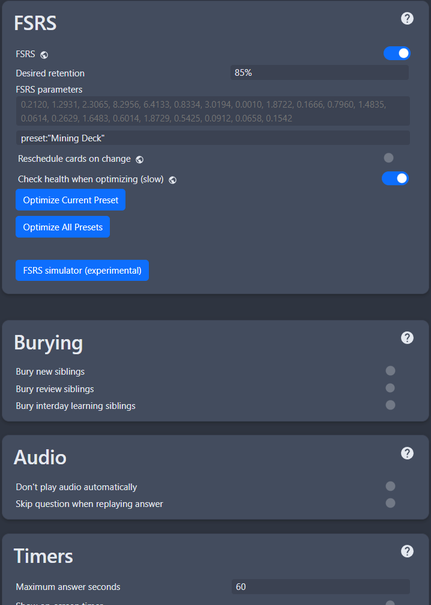

---
hide:
  - footer
---
# 英語イマージョン入門ガイド

- 初心者向けに、余計な文章や有料サービスへのリンクだらけのガイドを避けるための、できるだけ短くシンプルなガイドです。

## 学習のコツ

??? tips "初心者向け5つのアドバイス <small>(クリックして開く)</small>"

    - 一番大切なのは **「継続」と「意識して学ぶこと」** です。それ以外に特別な近道はありません。

    - **他人と比べないこと。** 「○か月で習得」などの成功談を気にせず、自分のペースで続けましょう。

    - とにかく始めましょう。**学習方法を調べることに時間を使いすぎて、実際に勉強していない人がとても多いです。** 始めなければ、いつまで経っても準備万端にはなりません。

    - **このガイドに書かれている日数や枚数は目安です。** 10倍時間がかかっても、逆にもっと早く終わっても問題ありません。

    - **「自分は頭が悪い」「もう年だから無理」なんてことはありません。** 母国語を覚えられたなら、他の言語も必ず学べます。オウムだって言葉を覚えます。

---

## 学習手順

1. [Anki](https://apps.ankiweb.net/) と、私が用意した [Ankiアドオン](https://drive.google.com/drive/folders/1dfmYAp0eg_bhhAkohUISYaS6B6QOBtww?usp=sharing) をダウンロードします。

    - `Anki add-ons` を展開（パスワード：`lazyguide`）し、`C:\Users\YourUser\AppData\Roaming\Anki2` にコピーしてください。
    - その後、`Anki` を再起動します。

3. [スーパー　イングリッシュ](https://ankiweb.net/shared/info/1918912484) をダウンロードして開きます。

    - 学習中は **「もう一度（1＝分からない）」** と **「正解（Space または 3＝分かった）」** の2つだけ使えば十分です。
    - 「難しい」や「簡単」を気にする必要はありません。

4. デッキの **オプション（歯車アイコン）** を開き、以下の設定を適用してください。

    - （画面左上）`ツール` → `設定` →　`設定` を開き、下記の設定も適用してください。

    ??? info "Anki設定 <small>(クリックして開く)</small>"

        === "設定1"
            {height=300 width=600}

        === "設定2"
            {height=300 width=600}

        === "設定3"
            {height=300 width=600}

        === "ツール　→　設定　→　学習"
            {height=300 width=600}

5. **スーパー　イングリッシュ** を **1日10枚**（多くても30枚まで）を目安に進めながら、**ステップ6の文法ガイド** も並行して学習しましょう。

6. 文法は次のどちらかを学習してください。

    - [English Club 文法ガイド](https://english-club.jp/blog/english-grammar/)
    - [Morite2 English Channel 文法講座](https://www.youtube.com/playlist?list=PLk7eC6WqGi91_PleXH3cqeMcSkcgAiH-P)

    大切なのは **内容をある程度理解しておくこと** です。文法は今後何百回も見返すことになります。

7. **スーパー　イングリッシュ** と **文法ガイド** を終えたら、**マイニング** と **実際のイマージョン** を始めましょう。

    - ここまでで、おおよそ **2〜4か月** が目安です（学習量によって前後します）。

8. イマージョン中に分からない文法があれば、以下を辞書代わりに使いましょう。

    - [Merriam Webster](https://www.merriam-webster.com/)

    **自分が好きな作品を読みましょう・見ましょう。**

    最初はかなり苦労しますが、それが普通なので続けてください。

9. あとは私の [Lazy Mining Guide](indexJP.md) を使って、お好みの媒体向けに最新の採掘環境をセットアップしてください。

    - **マイニング** とは、色々のところから **Ankiカードを作成すること** です。
    - このガイドで紹介しているツールなら **ワンクリックでマイニング** ができます。

---

### 最後に

- このガイドは **かなり簡略化した内容** なので、省略している情報もあります。
- 分からないことがあれば、英語イマージョン系のDiscordサーバーで質問したり、Discordで私に聞いていただいても大丈夫です。

- **教科書漬け** や **有料サブスク** に何年も時間を使ったり、「まだ準備が足りない」と思って勉強だけを続けたりする必要はありません。
- **イマージョンを始めなければ、いつまで経っても「準備万端」にはなりません。**