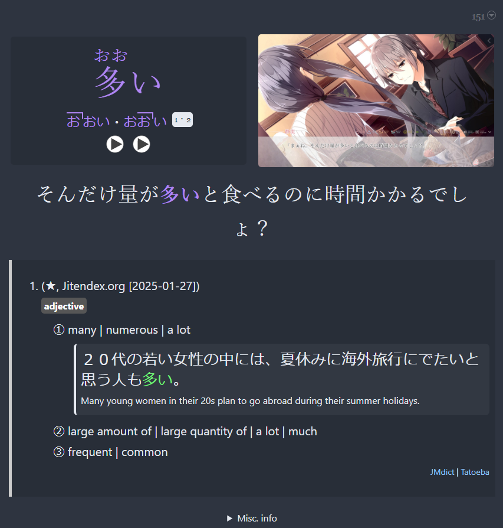
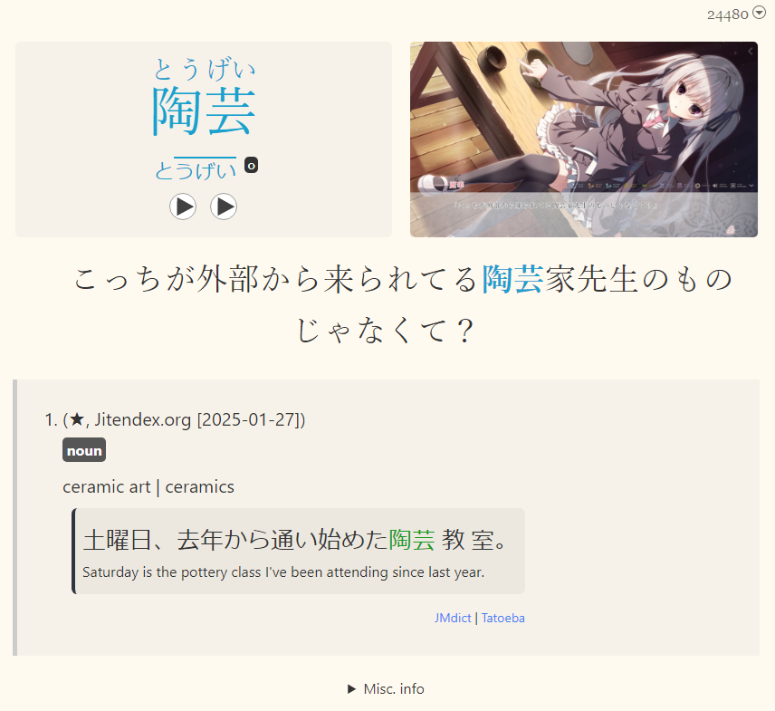
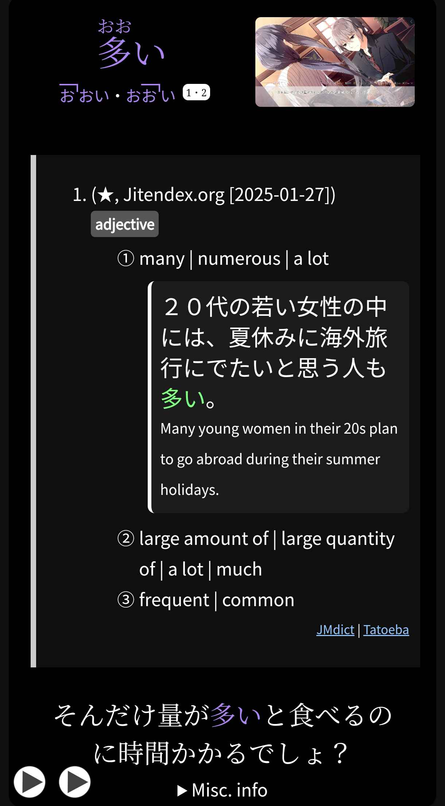
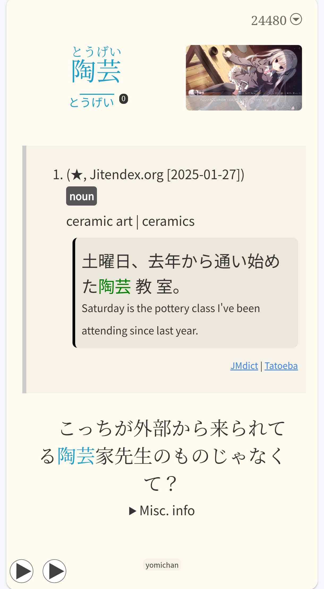
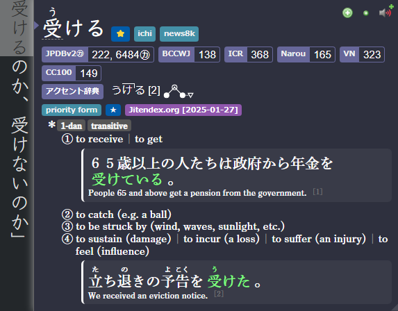
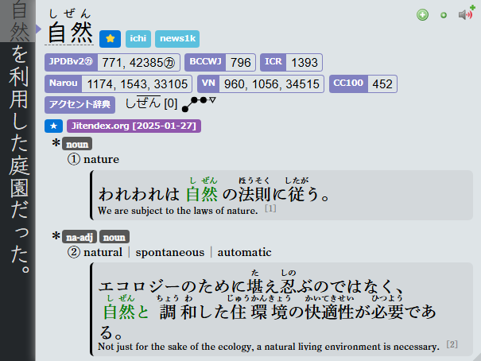

---
hide:
  - footer
---

??? note "JP Lazy Guideとは？ <small>(クリックして開く)</small>"

    - 細かい設定や技術的なことは気にせず、とにかく全部用意された環境をそのまま使いたい人向け
    - 他のガイドのようにツールごとに情報が分散しているのではなく、必要なものをまとめて一括導入したい人向け
    - 長く安定して使える環境が欲しい人向け（アップデートしなければ基本的に壊れません）

---

英語を始めたばかりで、すぐにイマージョンを始めたい方はこちら：
[英語イマージョン入門ガイド](conciseGuideToJumpstartEN.md)

---

## Anki・Yomitan レイアウト

=== "Anki"
    === "PC | ダーク"
        {height=300 width=600}
    === "PC | ライト"
        {height=300 width=600}
    === "モバイル | ダーク"
        {height=600 width=350}
    === "モバイル | ライト"
        {height=600 width=350}

=== "Yomitan"
    === "Yomitan | ダーク"
        {height=300 width=600}
    === "Yomitan | ライト"
        {height=300 width=600}
    === "Yomitan プロファイル"
        {height=300 width=600}

---

## [マイニングデモ](https://youtu.be/tUiXU2gn75g)

<iframe width="560" height="315" src="https://www.youtube.com/embed/tUiXU2gn75g" title="Mining Demo" frameborder="0" allow="accelerometer; autoplay; clipboard-write; encrypted-media; gyroscope; picture-in-picture; web-share" allowfullscreen></iframe>

[セットアップガイドへ進む](setupJP.md){ .md-button .md-button }