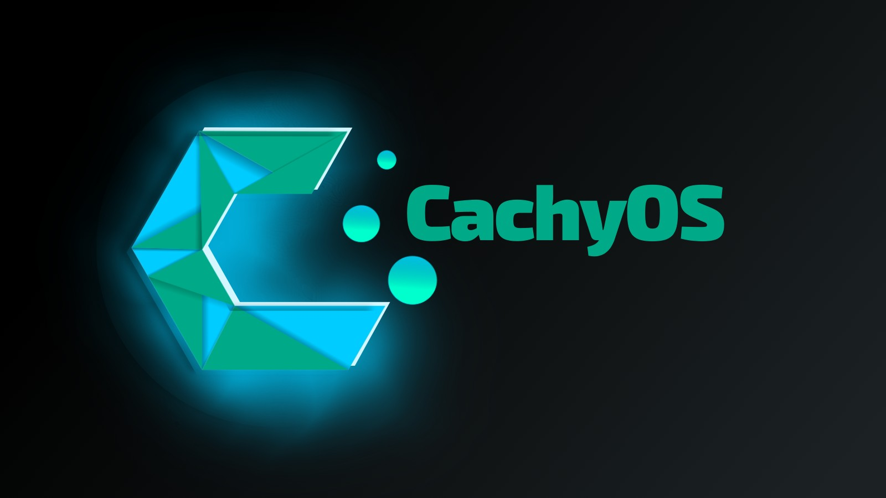

# Linuxセットアップの紹介

- できるだけ私のLazy Guideのセットアップに沿って説明しますが、Linuxなのでうまくいかない部分もあるかもしれません。
    - 例えば、「ターミナルの開き方」は説明しません。

- このガイドでは、主に `Arch Linux` ベースの [CachyOS](https://cachyos.org/)、`KDE Plasma`、`Wayland` 環境を前提として説明します。
    - 私が実際に使っている環境のみを扱うので、それ以外のディストリビューションについては各自で頑張ってください！

{height=500 width=1000}

[Linuxセットアップを始める](./setupLinux.md){ .md-button .md-button }