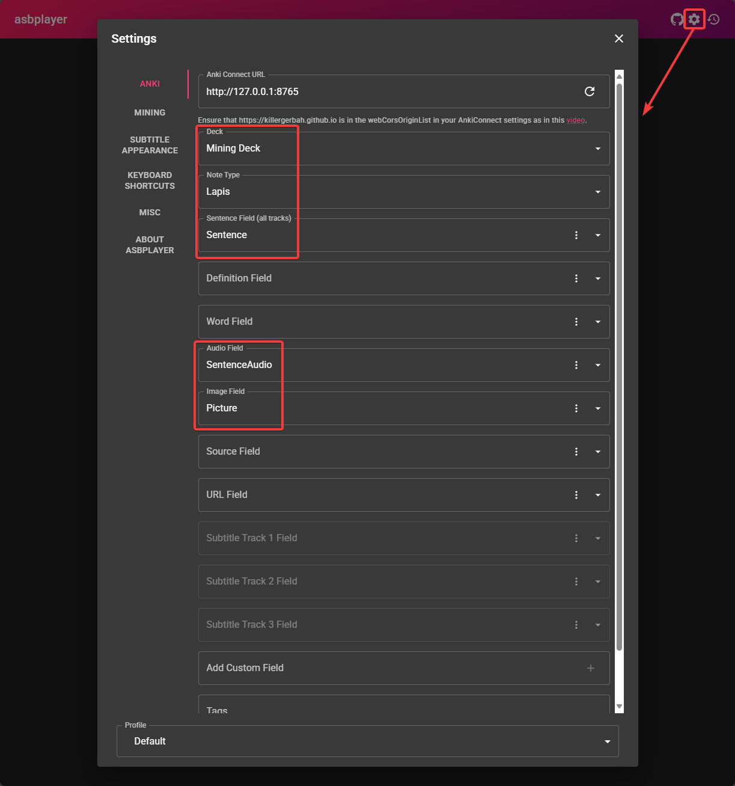
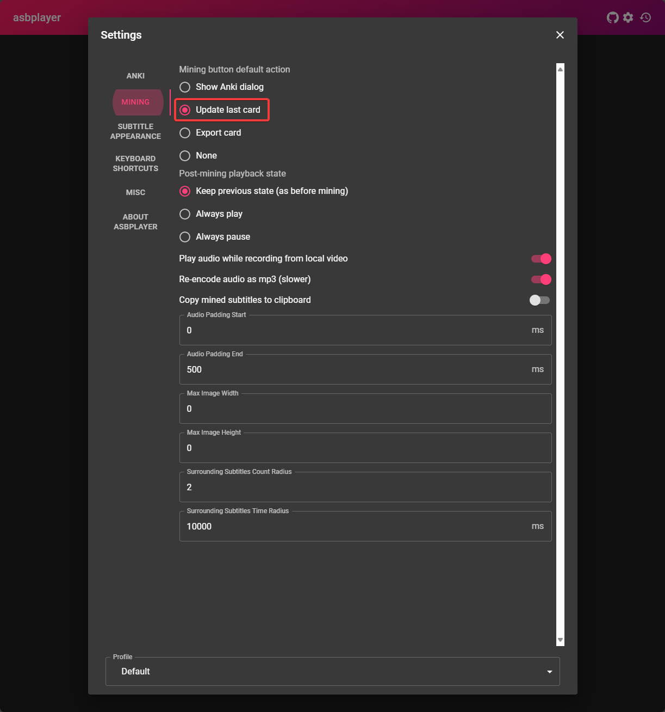
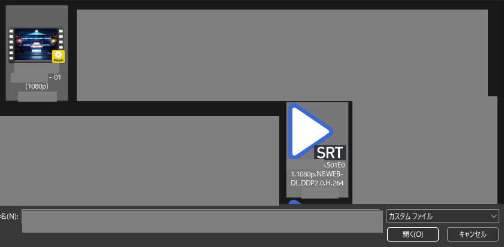

# Setup: Anime on Windows

- `asbplayer` is a browser video player that supports uploading of `Anime` and `subtitle` to be able hover over the words to use `yomitan`
- With the browser extension, it should also support streaming platforms such as `Youtube` or `Netflix`

---

## Download and Install

- Download your `Anime` and `JP Subtitle`
    - To get `JP subtitles` go to [Jimaku](https://jimaku.cc/)

- (Optional) For streaming video, download [asbplayer](https://chromewebstore.google.com/detail/asbplayer-language-learni/hkledmpjpaehamkiehglnbelcpdflcab) extension

Requirements

- [Yomitan on Windows](setupYomitanOnWindows.md) and [ShareX](setupShareX.md) already set-up

---

## Setting Up

1. In your browser, go to `chrome://flags` or `edge://flags`
    - Search for `Experimental Web Platform features` > `Enabled`

    {height=300 width=600}

2. Go to [asbplayer](https://killergerbah.github.io/asbplayer/)
    - Accept `request permission` to `Anki` and install the `Chrome extension`

3. On the top right of the page's settings(Cog icon); copy the [settings](setupAnki.md/#__tabbed_1_1) below
    - You can ignore the other fields not in `red box`

    === "Anki"
        {height=400 width=800}
    === "Mining"
        {height=400 width=800}

4. Upload your `Anime` and `Subtitle` to the `asbplayer` by clicking the `folder` icon on the top left
    - Ignore for streaming platforms like `Youtube` or `Netflix`

    === "Upload Files"
        {height=300 width=600}
    === "Pick Anime and Sub"
        {height=300 width=600}

5. To mine:
    - Hover over the word in the subtitles and mine with `Yomitan`
    - Tap `Ctrl + Shift + U` to automatically add `screenshot` and `audio` to `Anki`
    - (Optional) To change keyboard shortcuts: `Settings` > `Keyboard Shortcuts` > `Update last-created Anki card`

6. You can now mine using `asbplayer` and `yomitan`!
    - See [Anime Mining Demo](setupAnimeOnWindows.md/#info-1-anime-mining-demo)

You can now mine Anime on Windows, why not do it on Android too? (RIP eyes)

[Proceed to Setup: Anime on Android Setup](setupAnimeOnAndroid.md){ .md-button .md-button }

<small>If you have any problems check [FAQs](setupAnimeOnWindows.md/#faqs)</small>

---

## Extra Info and Tips

#### Info 1: Anime Mining Demo

??? info "Anime Mining Demo <small>(click here)</small>"

    - Outdated; you use asbplayer's hotkey(`Ctrl + Shift + U`) instead of `ShareX` hotkeys to automatically get both `screenshot` and `audio`

    <iframe width="560" height="315" src="https://www.youtube.com/embed/MAiNi_ME6zw" title="Mining Demo" frameborder="0" allow="accelerometer; autoplay; clipboard-write; encrypted-media; gyroscope; picture-in-picture; web-share" allowfullscreen></iframe>

#### Tip 1: Synchronizing Subtitle

??? tip "Synchronizing Subtitle <small>(click here)</small>"

    Depending on the source of your `Anime`, the `Subtitle` could be out of sync, to remedy that problem:

    - +100ms - `CTRL + SHIFT + LEFT ARROW KEY`

    - -100ms - `CTRL + SHIFT + RIGHT ARROW KEY`

#### Tip 2: Skip Audio Recording when Mining

??? tip "Skip Audio Recording when Mining <small>(click here)</small>"

    - You can skip the audio recording when mining as it is time consuming

    - If you also manage to do your Anki Cards below 5s each, you will barely hear the recorded Audio

---

## FAQs

#### Question 1: Why Enable Experimental Web Platform features?

??? question "Why Enable Experimental Web Platform features? <small>(click here)</small>"

    - Some `Anime` have multiple `audio sources` such as `en` and `jp`, by enabling this we can pick `jp` source if it's not the default

#### Question 2: Why Ignore Request Permission to Anki?

??? question "Why Ignore Request Permission to Anki? <small>(click here)</small>"

    - Because we are using the normal method where we can use the full features of `Anki` and `Yomitan` setup

#### Question 3: Why not install the Chrome Extension?

??? question "Why not install the Chrome Extension? <small>(click here)</small>"

    - Same as `Question 2`, `asbplayer` has a built-in `Anki` support that lacks the feature of our own `Anki` and `Yomitan` support
