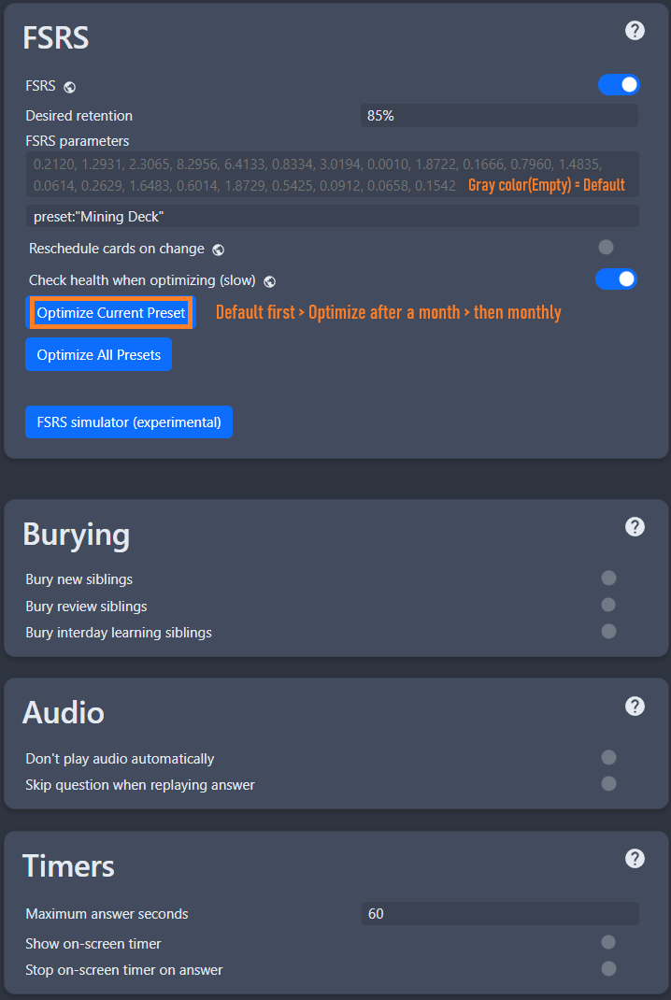
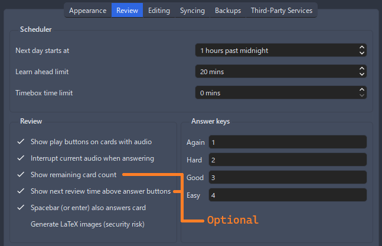
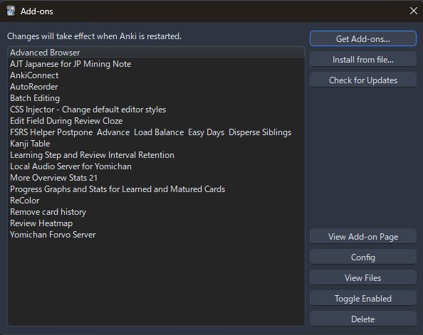
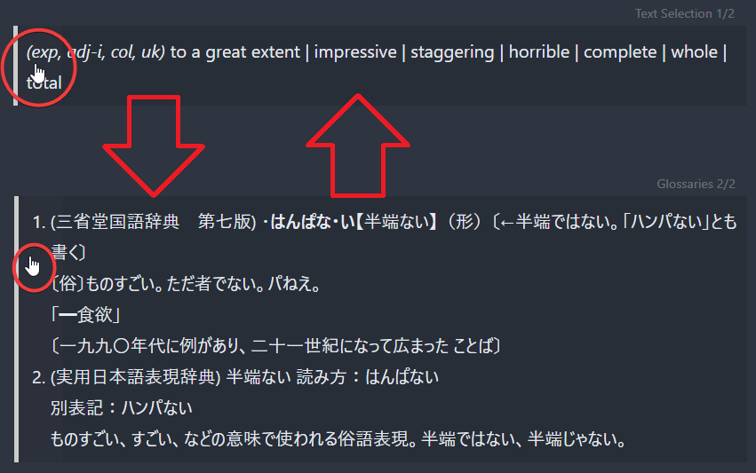
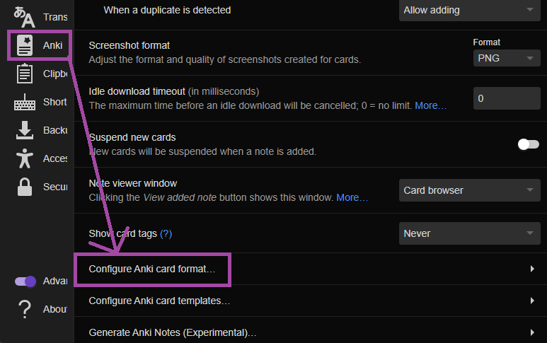

# Setup: Anki

- Anki is a SRS flash card program for card reviewing and the due dates are decided by the algorithm
- Mobile is supported
- Anki [Light](../img/anki-pc-light.png) | [Dark](../img/anki-pc-dark.png) Mode

---

- Transferring from JPMN Format?
    - Check [Transfer: JPMN to Lapis](transferJPMNToLapis.md)
- Updating your existing Lapis Format?
    - Go to [Updating: Lapis Format](updatingAnkiLapisFormat.md)

---

## Download and Install

- Install `PC` [Anki](https://apps.ankiweb.net/)
    - [Android](https://play.google.com/store/apps/details?id=com.ichi2.anki&hl=en_US) | [iOS](https://apps.apple.com/us/app/ankimobile-flashcards/id373493387) (Install guide is for `PC` only but you can use it on mobile afterwards)
- Download [Anki addons](https://drive.google.com/drive/folders/1dfmYAp0eg_bhhAkohUISYaS6B6QOBtww?usp=sharing)

---
## Setting Up
1. Open Anki and create an account and profile by clicking the `Sync` button

    {height=250 width=500}

2. Extract([?](https://www.webhostinghub.com/help/learn/website/managing-files/extract-file)) `Anki addons21.7z`(Pass: `lazyguide`) and paste the `addons21` folder to `C:\Users\**YourUser**\AppData\Roaming\Anki2`
    
    {height=150 width=300}

3. Restart your Anki, then `Ctrl + Shift + A` OR `Tools` > `Add-ons` > `Check for add-ons update`
    - Update the `addons` then restart it again

    {height=250 width=500}

4. Download [Lapis](https://github.com/donkuri/lapis/releases/latest) format
    - Scroll down to Assets, and look for `Lapis.apkg`
    
    {height=150 width=300}

5. Import `Lapis.apkg` to Anki

    {height=300 width=600}

6. Rename `Lapis` to `Mining Deck`

    {height=250 width=500}

7. Go to your `Deck`'s option(Cog icon) then copy the [settings](setupAnki.md/#__tabbed_1_1) below
    - ([Settings 2](setupAnki.md/#__tabbed_1_2)) Turn on `FSRS`
    - ([Settings 2](setupAnki.md/#__tabbed_1_2)) Until after 1 month, use `default parameters`; after that:
        - Use `Optimize current preset` every month
        - (Optional) `Tools` > `FSRS4Anki Helper` > `Reschedule all Cards`

    - (Menu Bar - Top Left) `Tools` > `Preferences` and set the [settings](setupAnki.md/#__tabbed_1_4) accordingly

    === "Settings 1"
        {height=300 width=600}
    === "Settings 2"
        {height=300 width=600}
    === "Settings 3"
        {height=300 width=600}
    === "Anki Preference Settings"
        {height=300 width=600}

8. Restart your `Anki` and it should be good to go

You now have an Anki Template, next is Yomitan

[Proceed to Yomitan Setup](setupYomitanOnPC.md){ .md-button .md-button }

---

## Extra Info and Tips

#### Info 1: Anki Add-ons List

??? info "Anki Add-ons List <small>(click here)</small>"

    Here's the list of Anki Add-ons:

    - You can search them by clicking `View Add-on Page` to know more about them
    - Most of them are in `Tools` in the `Taskbar`

    {height=250 width=500}

#### Info 2: Anki Light and Dark Mode

??? info "Anki Light and Dark Mode <small>(click here)</small>"

    To change the anki theme, go to `Tools` > `Preferences` > `Theme`

    {height=300 width=600}

#### Info 3: Retention How To

??? info "Retention How To <small>(click here)</small>"

    If you found yourself having low retention, go to [Retention How-To](retentionHowTo.md) for anki settings suggestions and other tips

#### Tip 1: When Reviewing on Anki

??? tip "When Reviewing on Anki <small>(click here)</small>"

    - Just use `again (1 = I don't know the answer)` or `good (spacebar or 3 = I know the answer)` button when doing the deck so you don't have to think about if it's `easy (2)` or `hard (4)`

#### Tip 2: Anki Pitch Accent Color

??? tip "Anki Pitch Accent Color <small>(click here)</small>"

    When viewing a card, they are color assigned with the following:

    {height=250 width=500}

#### Tip 3: Anki Definition Glossary switch

??? tip "Anki Definition Glossary switch <small>(click here)</small>"

    When reviewing a card, you can tap the definition's left side to switch between `Monolingual` and `Bilingual`

    {height=250 width=500}

## FAQs

#### Question 1: Where should I put more image aside from screenshot?

??? question "Where should I put more image aside from screenshot <small>(click here)</small>"

    - You can put multiple pictures in `DefinitionPicture` in `Anki` > `Browse` > Select a `Card`

    - You can paste the image while reviewing by going `Edit` mode or `E` shortcut

#### Question 2: Where can I ask if something is wrong with my Lapis Anki Format?

??? question "Where can I ask if something is wrong with my Lapis Anki Format? <small>(click here)</small>"

    - In [Lapis' FAQ](https://github.com/donkuri/lapis?tab=readme-ov-file#faq) page

#### Question 3: How to change the styling like font or size?

??? question "How to change the styling like font or size? <small>(click here)</small>"

    - Refer [here](https://github.com/donkuri/lapis?tab=readme-ov-file#how-can-i-change-the-font-size)

#### Question 4: Can I rename the deck?

??? question "Can I rename the deck? <small>(click here)</small>"

    - Technically yes, but I wouldn't recommend; you have to resetup Yomitan's `Anki Card Format` and Anki's Add-on `AutoReorder`

#### Question 5: How can I use sentence card?

??? question "How can I use sentence card? <small>(click here)</small>"

    If you haven't yet, please setup [Yomitan](setupYomitanOnPC.md) first (The next guide after this)

    ??? info "Okay, I've already set it up! <small>(click here)</small>"

        In your `Yomitan settings` > `Anki` > `configure Anki card format...`

        {height=300 width=600}
        
        In `Terms` scroll down and find `IsSentenceCard` and put `1` then close the window

        {height=300 width=600}

        Now apply it on every profile under `Editing Profile` and make sure `Monolingual`, `Bilingual`, `Android (Anime, LN & Manga)` and `Android (VN)` got their config changed

        {align=left height=300 width=600}
