# セットアップ: Anki

- Ankiは、SRS（間隔反復学習）を利用した単語カード学習ソフトです。復習日はアルゴリズムによって自動的に決定されます。
- モバイル版にも対応しています。
- Anki [ライトモード](../img/anki-PC-light.png) | [ダークモード](../img/anki-PC-dark.png)

---

## ダウンロードとインストール

- `PC版`の[Anki](https://apps.ankiweb.net/)をインストールします。
    - [Android](https://play.google.com/store/apps/details?id=com.ichi2.anki&hl=en_US) | [iOS](https://apps.apple.com/us/app/ankimobile-flashcards/id373493387)
    - このガイドは`PC版`を前提にしていますが、設定後はモバイル版でも利用できます。
- [Anki Add-ons](https://drive.google.com/drive/folders/1dfmYAp0eg_bhhAkohUISYaS6B6QOBtww?usp=sharing)をダウンロードします。

---

## セットアップ

1. Ankiを起動し、`同期`ボタンをクリックしてアカウントとプロフィールを作成します。

    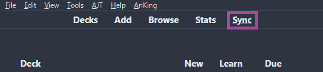{height=250 width=500}

2. `Anki addons21.7z`（パスワード：`lazyguide`）を展開し、`addons21`フォルダーを `C:\Users\**ユーザー名**\AppData\Roaming\Anki2` にコピーします。

    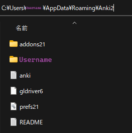{height=150 width=300}

3. Ankiを再起動し、`Ctrl + Shift + A` または `ツール` → `アドオン` → `アドオンの更新を確認` を開きます。

    - アドオンを更新したら、もう一度Ankiを再起動してください。

    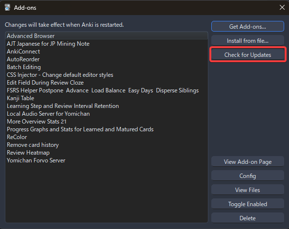{height=250 width=500}

4. [Lapis](https://github.com/donkuri/lapis/releases/latest) フォマットをダウンロードします。

    - ページ下部の **Assets** から `Lapis.apkg` をダウンロードしてください。

    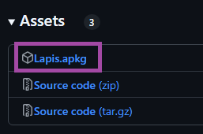{height=150 width=300}

5. `Lapis.apkg` をAnkiへインポートします。（下の画像を参考にしてください。）

    - ※ If newer = 既存のものより新しい場合は行う

    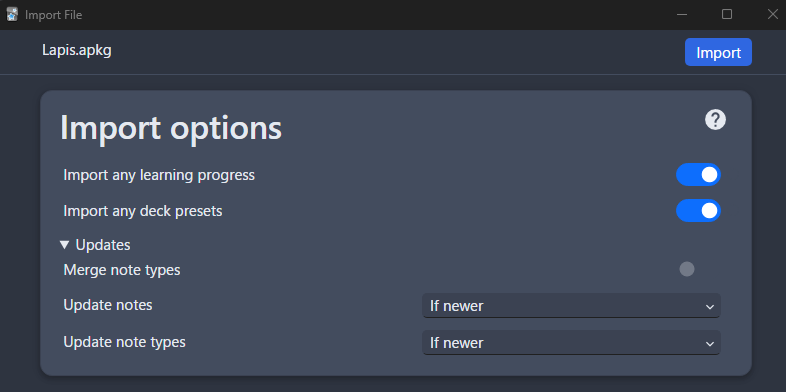{height=300 width=600}

6. デッキ名を `Lapis` から `Mining Deck` に変更します。

    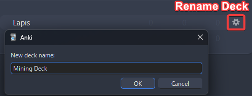{height=250 width=500}

7. デッキ右側の歯車アイコンから `デッキオプション` を開き、以下の設定を適用してください。

    - （[設定1](setupAnki.md/#__tabbed_1_1)）`1日の新規カード上限`は **10～30枚** をおすすめします。
    - （[設定2](setupAnki.md/#__tabbed_1_2)）`FSRS` を有効にします。
    - 最初の1か月間はデフォルトパラメータを使用してください。その後は以下を行います。
        - 毎月 `このﾌﾟﾘｾｯﾄで最適化` を実行します。
        - （任意）`デッキオプション` → `FSRS Helper` → `Reschedule all Cards`

    - メニューバー左上の `ツール` → `設定` → `学習` を開き、以下の設定を適用してください。

    === "設定１"
        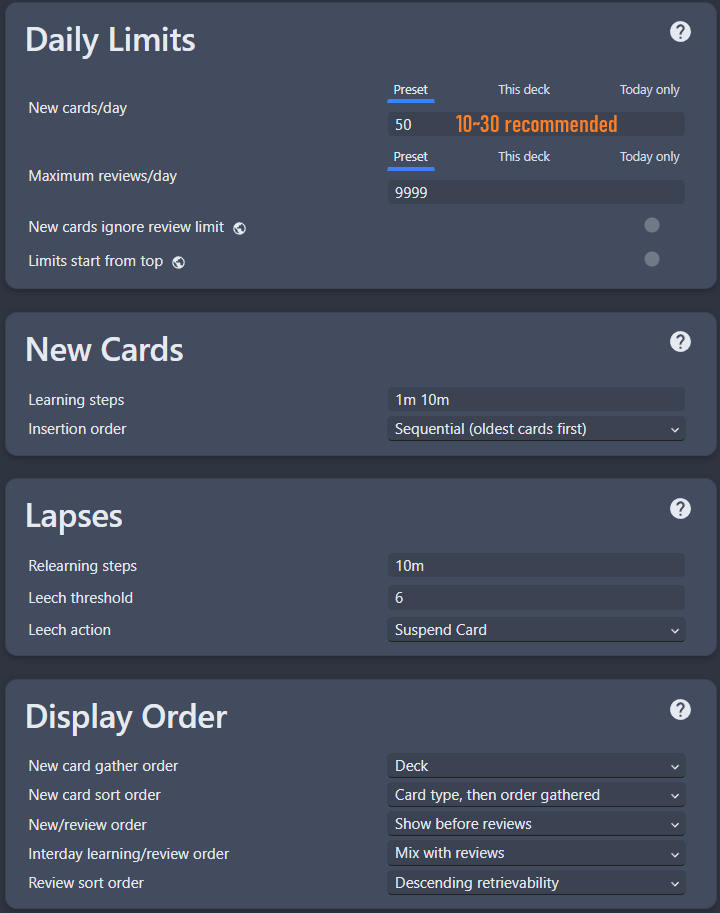{height=300 width=600}
    === "設定２"
        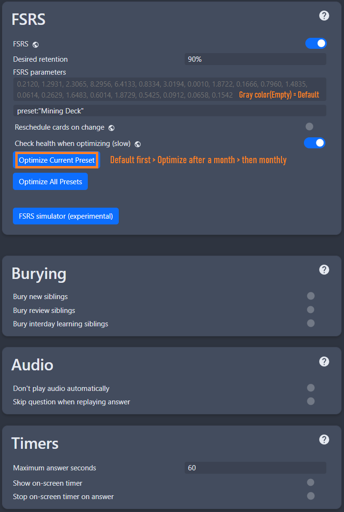{height=300 width=600}
    === "設定３"
        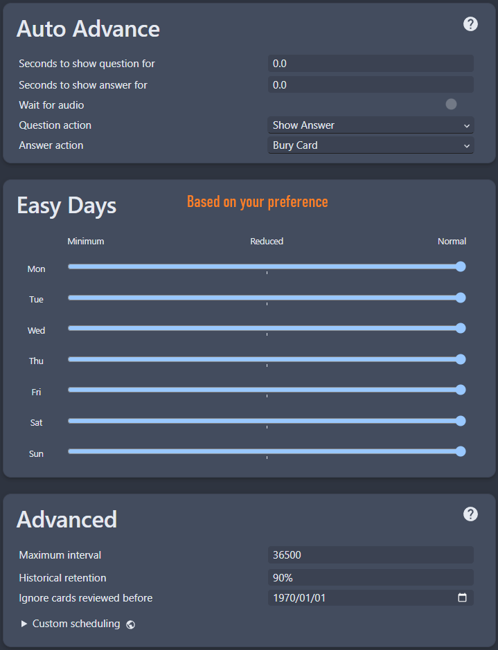{height=300 width=600}
    === "ツール　→　設定　→　学習"
        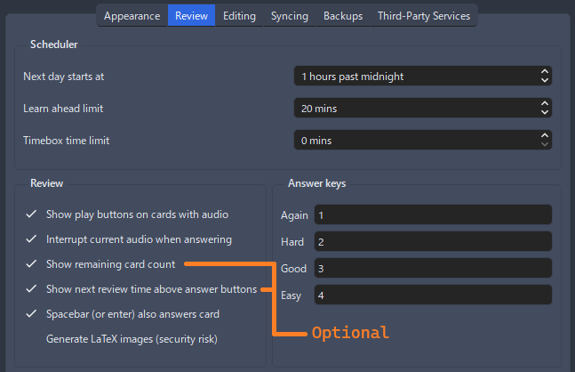{height=300 width=600}

8. 最後にAnkiを再起動すればセットアップは完了です。

これでAnkiテンプレートの準備ができました。次はYomitanのセットアップです。

[Yomitanのセットアップへ進む](setupYomitanOnPCJP.md){ .md-button .md-button }

---

## 補足情報・ヒント

#### 情報1: Ankiアドオン一覧

??? info "Ankiアドオン一覧 <small>(クリックして開く)</small>"

    使用しているAnkiアドオンの一覧です。

    - 詳細を確認したい場合は、`View Add-on Page` をクリックしてください。
    - 多くのアドオンはメニューバーの `ツール` から利用できます。

    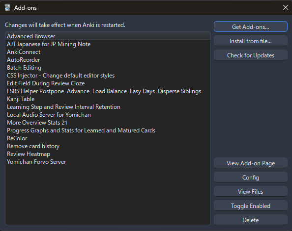{height=250 width=500}

#### 情報2: Ankiのライトモード・ダークモード

??? info "Ankiのライトモード・ダークモード <small>(クリックして開く)</small>"

    テーマを変更するには、

    `ツール` → `設定` → `Theme`

    を開いてください。

    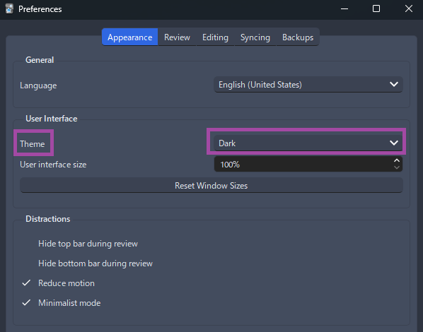{height=300 width=600}

#### 情報3: Retention（定着率）の改善方法

??? info "Retention（定着率）の改善方法 <small>(クリックして開く)</small>"

    定着率が低いと感じる場合は、[Retention How-To](retentionHowTo.md) をご覧ください。

    Ankiの設定例や学習のコツを紹介しています。

#### 情報4: FSRS 間隔トラブルシューティング

??? info "FSRS 間隔トラブルシューティング <small>(クリックして開く)</small>"

    [source](https://www.reddit.com/r/Anki/comments/1mrsr30/i_updated_the_fsrs_interval_troubleshooting/)

    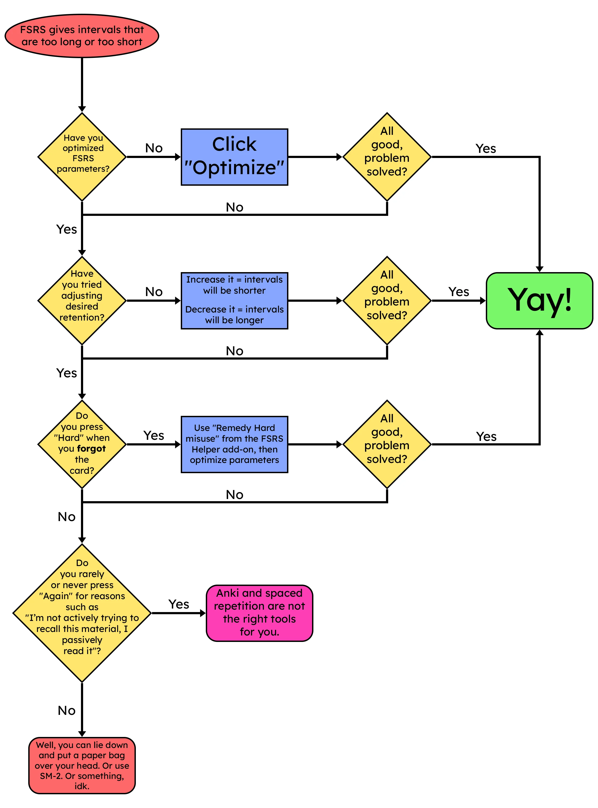{height=400 width=800}

#### ヒント1: Ankiで復習するとき

??? tip "Ankiで復習するとき <small>(クリックして開く)</small>"

    - 基本的には `もう一度（1：わからなかった）` と `正解（Space または 3：わかった）` だけを使うことをおすすめします。
    - `ムズカシイ` や `簡単` を毎回考える必要はありません。

---

## FAQ

#### 質問1: スクリーンショット以外の画像はどこに追加すればいいですか？

??? question "スクリーンショット以外の画像はどこに追加すればいいですか？ <small>(クリックして開く)</small>"

    - `Anki` → `ブラウズ` → カードを選択し、`DefinitionPicture` に複数の画像を追加できます。

    - 復習中でも、`Edit` または `E` キーから画像を貼り付けることができます。

#### 質問2: Lapisテンプレートについて質問したい場合は？

??? question "Lapisテンプレートについて質問したい場合は？ <small>(クリックして開く)</small>"

    - [Lapis FAQ](https://github.com/donkuri/lapis?tab=readme-ov-file#faq) をご確認ください。

#### 質問3: フォントや文字サイズを変更するには？

??? question "フォントや文字サイズを変更するには？ <small>(クリックして開く)</small>"

    - 詳しくは [こちら](https://github.com/donkuri/lapis?tab=readme-ov-file#how-can-i-change-the-font-size) をご覧ください。

#### 質問4: デッキ名を変更できますか？

??? question "デッキ名を変更できますか？ <small>(クリックして開く)</small>"

    - 変更は可能ですが、おすすめしません。
    - 変更した場合は、Yomitanの `Anki Card Format` や、Ankiアドオンの `AutoReorder` を再設定する必要があります。

#### 質問5: 文法 Cardを使うには？

??? question "文法 Cardを使うには？ <small>(クリックして開く)</small>"

    まだ設定していない場合は、先に [Yomitan](setupYomitanOnPC.md) をセットアップしてください。

    ??? info "セットアップ済みです <small>(クリックして開く)</small>"

        `Yomitan Settings` → `Anki` → `Configure Anki flashcards...` を開きます。

        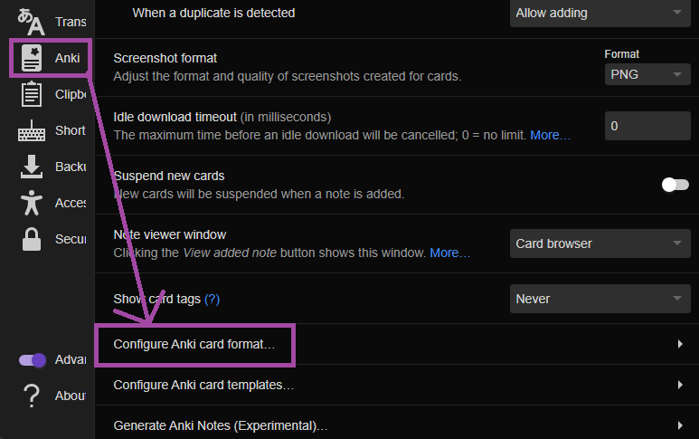{height=300 width=600}

        `Terms` を下へスクロールし、`IsSentenceCard` を `1` に設定して閉じます。

        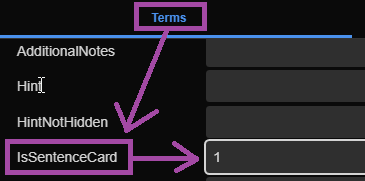{height=300 width=600}

        その後、`Editing Profile` にあるすべてのプロファイルへ適用してください。

        - `Monolingual`
        - `Bilingual`
        - `Android (Anime, LN & Manga)`
        - `Android (VN)`

        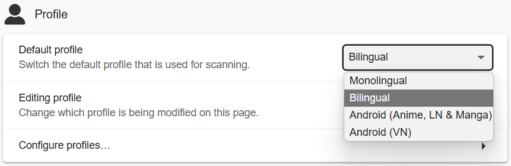{height=300 width=600}