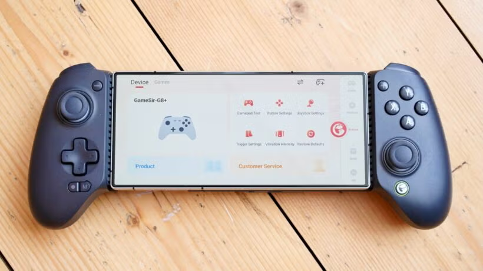

---
hide:
  - footer
---
# Setup: Gaming on Android

- A portable heavy-gaming setup for `Android`; streaming your gaming PC by using `Apollo` and `Artemis`

- This is **GAMING** focused not mining; an alternative Steam Deck

- Similar to [Setup: VN on PC](setupVnOnPC.md) it streams from `PC` to `Android`, but smoother compared to `Steam Link`
    - Tested in 1440p/120fps max settings Cyberpunk 2077 and other lower spec games

- Based on this [video](https://www.youtube.com/watch?v=ERC7UrkRL2c)
    - I used `Artemis` instead of `Moonlight`

- (Recommmended Gamepad) `GameSir G8 Plus`
    - Bluetooth, Rumble, Gyro, Hall-effect, back pedal, hotswappable
    - Not to be confused with the Type-C non-plus version(no rumble/gyro)

- (Budget Gamepad) `GameSir X5 Lite`

    {height=300 width=600}

---

## Download and Install

PC:

- [Apollo .exe](https://github.com/ClassicOldSong/Apollo/releases/latest) (Host Server)

- [ViGEmBus .exe](https://github.com/nefarius/ViGEmBus/releases/latest) (For Controller compatibility)

Android:

 - [Artemis .apk](https://github.com/ClassicOldSong/moonlight-android/releases/latest) (Streaming App)

---

### Configuration

#### Android

- On Artemis Settings:
    - Video Resolution > Native (non full-screen)
    - Video frame rate > 120fps (if your device can handle it)
    - Video bitrate([?](setupGamingOnAndroid.md/#additional-info)) > 50Mbps (Tested on 1440p/120fps Max settings Cyberpunk busy area)
        - You can lower it to 25~40Mbps if you are using 30/60fps and lower resolution
    - Enable multi-touch gestures (for pop-up keyboard)

- (Optional) If you have a notch and want your screen to be centered
    - In your Android settings(Xiaomi) > notification and status bar > Notch in individual apps > Artemis > Always Show Notch
    - Look for a similar settings depending on your phone brand

---

#### PC

1. Start menu(winkey) > search Apollo > Open `Apollo`

2. Setup profile(make your account) > `login`

3. Pin > PIN Pairing > pair your android(open the `Artemis` app > select the PC) and PC > Connect

4. Pin > Device Management > select paired device > `always create virtual display` > save
    - This is where you also confirm if `Controller Input` is detected (pair your controller to your android first)
    - Virtual Controller is also supported when you are already streaming on your android under options

5. Configuration > audio/video > advanced display device options > `Deactivate other displays and activate only the specified display` > save
    - This `will turn off your monitor` while you're connected to your android device (Important for auto virtual display)
    - To apply changes: Troubleshooting > `Restart Apollo` (if no prompt)

6. (OPTIONAL) On Android device, you can wake your PC from Sleep/Hibernate through `Artemis`; Wake on LAN:
    - On your PC, Device Manager > Network Adapter > Realtek(or whatever you are using as internet) > Properties > Advance > Wake on Magic Packet > Enable
    - On your BIOS, look for wake up event settings > wake by PCI-E > Enable

---

### How to use

1. On your Android Device > Open `Artemis` > Select your PC > Desktop
    - Then pick your game, including non-steam games
    - For keyboard gesture, 4 fingers tap at the same time (Spread through your screen, not together)

2. Make sure to select `Quit Session` or Exit the app properly so your PC monitor goes back to life

3. Enjoy? lol

---

### Additional Info

- Video Bitrate Data based on Max settings Cyberpunk 2077:
    - 20~25Mbps: 720p or 1080p/60fps
    - 30~40Mbps: 1080p/120fps
    - 50Mbps: 1440p/120fps

---