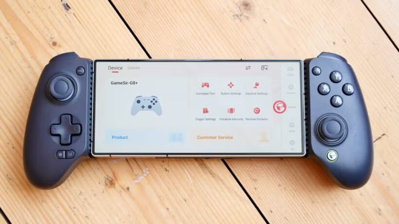

---
hide:
  - footer
---
# セットアップ：Androidでゲーム

- `Apollo` と `Artemis` を使ってゲーミングPCをストリーミングする、`Android` 向けの本格ゲーム環境です。

- このガイドは **ゲーム用** であり、採掘（Mining）用ではありません。Steam Deck の代替として使えます。

- [セットアップ：PCでVN](setupVnOnPC.md) と同じように `PC` から `Android` へストリーミングしますが、`Steam Link` よりも快適に動作します。
    - 1440p / 120fps・Cyberpunk 2077 の最高設定、およびその他の比較的軽いゲームで動作確認済みです。

- この [動画](https://www.youtube.com/watch?v=ERC7UrkRL2c) を参考にしています。
    - 私は `Moonlight` の代わりに `Artemis` を使用しています。

- （おすすめコントローラー）`GameSir G8 Plus`
    - Bluetooth、振動、ジャイロ、ホールエフェクト、背面ボタン、ホットスワップ対応
    - Type-C 接続の無印版（振動・ジャイロ非対応）とは別製品なので注意してください。

- （低価格帯のおすすめ）`GameSir X5 Lite`

    {height=300 width=600}

---

## ダウンロードとインストール

### Windows

- [Apollo .exe](https://github.com/ClassicOldSong/Apollo/releases/latest)（ホストサーバー）

- [ViGEmBus .exe](https://github.com/nefarius/ViGEmBus/releases/latest)（コントローラー互換用）

### Linux

- [Sunshine](https://github.com/LizardByte/pacman-repo)（ホストサーバー）

### Android

- [Artemis .apk](https://github.com/ClassicOldSong/moonlight-android/releases/latest)（ストリーミングアプリ）
- [Moonlight](https://play.google.com/store/apps/details?id=com.limelight&pcampaignid=web_share)（Linux向けストリーミングアプリ）

---

## 設定

### Android

- Artemis の設定：
    - Video Resolution → Native（フルスクリーンではない）
    - Video frame rate → 120fps（端末が対応している場合）
    - Video bitrate（[?](setupGamingOnAndroidJP.md/#_4)）→ 50Mbps（1440p / 120fps・Cyberpunk 2077 の最高設定で検証）
        - 30fps / 60fps や低解像度なら 25〜40Mbps でも十分です。
    - Enable multi-touch gestures（ポップアップキーボード用）を有効化

- （任意）ノッチがあり、画面を中央表示したい場合
    - Android の設定（Xiaomi）→ 通知とステータスバー → アプリごとのノッチ表示 → Artemis → 常にノッチを表示
    - 機種によって名称が異なる場合があります。

---

### PC

1. スタートメニュー（Windowsキー）→ 「Apollo」を検索して起動

2. プロフィールを作成し、ログイン

3. **Pin → PIN Pairing** を開き、Android 側（Artemis で PC を選択）と PC をペアリングして接続

4. **Pin → Device Management** → ペアリングした端末を選択 → **Always create virtual display** を有効にして保存
    - Android にコントローラーを接続しておけば、ここで入力が認識されているか確認できます。
    - Android でストリーミング中は仮想コントローラーも利用できます。

5. **Configuration → Audio/Video → Advanced Display Device Options** → **Deactivate other displays and activate only the specified display** を有効にして保存
    - Android 接続中は **PC のモニターが自動で消灯** します（仮想ディスプレイを自動利用するため重要）。
    - 反映されない場合は **Troubleshooting → Restart Apollo** を実行してください。

6. （任意）Android からスリープ・休止状態の PC を起動したい場合（Wake on LAN）
    - Windows：デバイスマネージャー → ネットワークアダプター → Realtek（または使用中のアダプター）→ プロパティ → 詳細設定 → **Wake on Magic Packet** を有効
    - BIOS：Wake by PCI-E（または同等の設定）を有効

---

## 使い方

1. Android で **Artemis** を起動 → PC を選択 → **Desktop**
    - Steam・非Steam問わず好きなゲームを起動できます。
    - キーボードを表示するには、画面を **4本指で同時タップ**（指は少し離してタップ）。

2. 終了するときは **Quit Session** を選ぶか、正しくアプリを終了してください。
    - PC のモニターが元に戻ります。

3. あとはゲームを楽しみましょう（笑）

---

## 補足

- Cyberpunk 2077（最高設定）でのビットレート目安
    - 20〜25Mbps：720p または 1080p / 60fps
    - 30〜40Mbps：1080p / 120fps
    - 50Mbps：1440p / 120fps