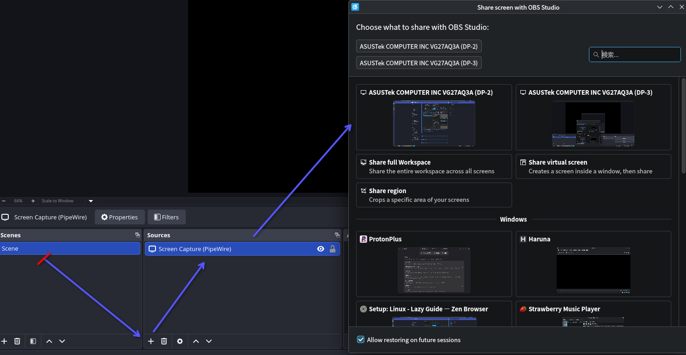
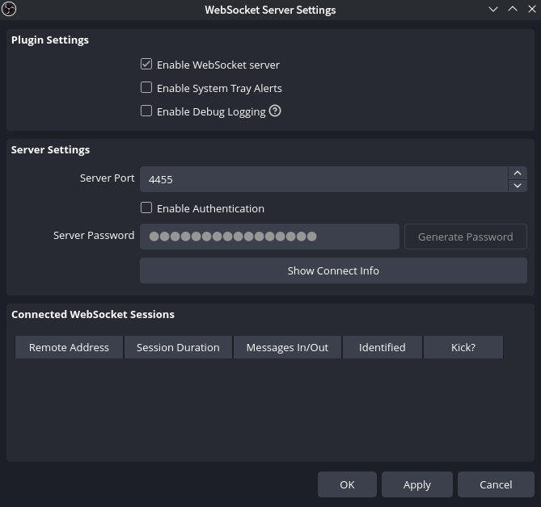
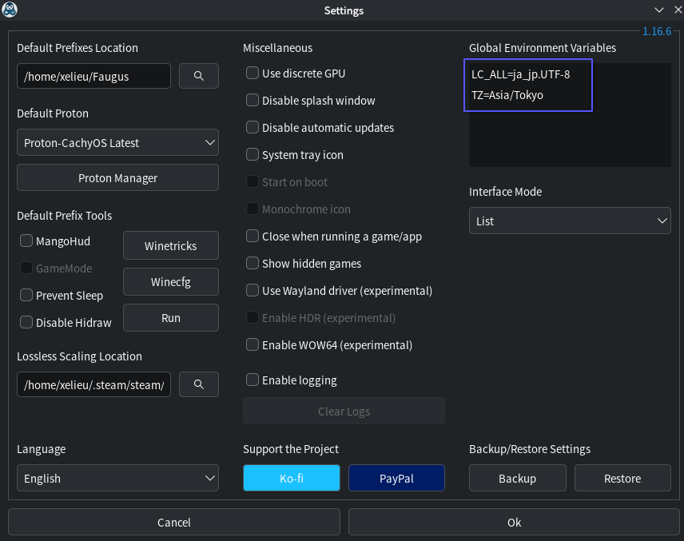
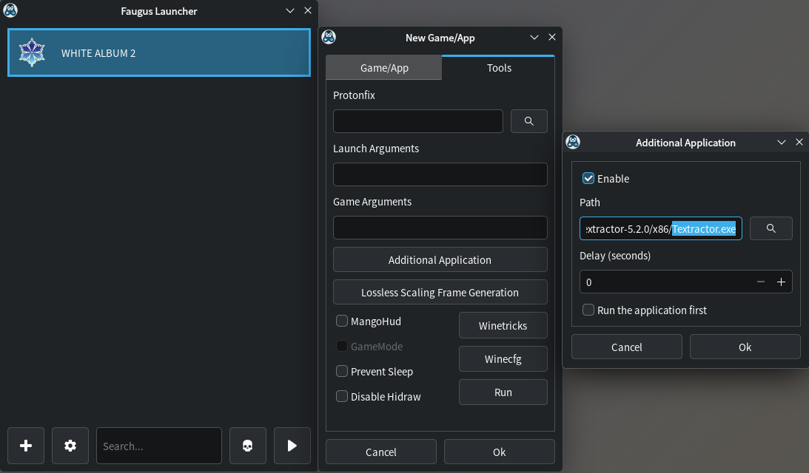

---
hide:
  - footer
---

- All guides are compiled in a single page as most will diverge to the original guide
    - To avoid confusion, I'll indicate if a guide is not needed (i.e. yomitan)

- Work In Progress
    - Have [automated screenshot](setupLinux.md/#screenshot-mining) but no automated audio yet (check [GSM](https://github.com/bpwhelan/GameSentenceMiner) if you like, but its too bloated for my "lazy" taste)

---
???note "Prerequisite Packages <small>(click here)</small>"
    ## Prerequisite Packages
    
    The compiled install if you are planning to follow everything:

    **Pacman**

    - 7zip (Optional)
    - Anki
    - Flatpak
    - Python (for OCR/Manga)
    - Zen Browser (Optional; based on firefox)
    - Fcitx5
    - Mozc
    - Noto Sans JP
    ```
    sudo pacman -S p7zip anki flatpak python python-pip tk zen-browser-bin fcitx5-im fcitx5-mozc noto-fonts-cjk
    ```
    
    **Flatpak**

    - OBS Studio
    ```
    flatpak install flathub -y com.obsproject.Studio
    ```

    **Paru (AUR)**

    - Faugus Launcher (For VN)
    ```
    paru -S --noconfirm faugus-launcher
    ```

---

??? note "JP Input and Font Display <small>(click here)</small>"
    ## JP Input and Font Display

    **JP Input Install**
    
    1. First, install the package for `fcitx5`, `mozc` and `noto-sans jp` font
    ```
    sudo pacman -S fcitx5-im fcitx5-mozc noto-fonts-cjk
    ```
    2. Create and open file
    ```
    mkdir -p ~/.config/environment.d
    nano ~/.config/environment.d/fcitx.conf
    ```
    3. Paste this config:
    ```
    GTK_IM_MODULE=fcitx
    QT_IM_MODULE=fcitx
    SDL_IM_MODULE=fcitx
    XMODIFIERS=@im=fcitx
    ```
    4. Then `CTRL + O` > ENTER > `CTRL + X`

    5. You can now close the terminal
    
    **JP Input Setup**
    
    1. Relogin/restart your PC

    2. KDE system settings > keyboard > virtual keyboard > `Fcitx 5`

    3. KDE system settings > keyboard > configure keybindings > 日本語キーボードオプション > make zenkaku hankaku an additional esc > OFF
    
    4. KDE system settings > input method > add `Mozc` (Sometimes its already there)

    **Font Display**

    1. Go to `~/.config/fontconfig/fonts.conf`

    2. On your `fonts.conf`, replace everything with the config below based on [Arch Wiki](https://wiki.archlinux.org/title/Font_configuration/Examples#CJK,_but_other_Latin_fonts_are_preferred):

        ??? note "font.conf <small>(click here)</small>"
            ```
            <?xml version="1.0"?>
            <!DOCTYPE fontconfig SYSTEM "urn:fontconfig:fonts.dtd">
            <fontconfig>
            <!-- Default serif font -->
            <alias binding="strong">
                <family>serif</family>
                <prefer>
                <family>PT Serif</family>
                </prefer>
            </alias>

            <!-- Default sans-serif font -->
            <alias binding="strong">
                <family>sans-serif</family>
                <prefer>
                <family>Roboto</family>
                </prefer>
            </alias>

            <!-- Default monospace font -->
            <alias binding="strong">
                <family>monospace</family>
                <prefer>
                <family>Cascadia Code PL</family>
                </prefer>
            </alias>

            <!-- Default system-ui font -->
            <alias binding="strong">
                <family>system-ui</family>
                <prefer>
                <family>Roboto</family>
                </prefer>
            </alias>

            <!-- Serif CJK -->

            <!-- Default serif when the "lang" attribute is not given -->
            <!-- You can change this font to the language variant you want -->
            <match target="pattern">
                <test name="family">
                <string>serif</string>
                </test>
                <edit name="family" mode="append" binding="strong">
                <string>Noto Serif CJK SC</string>
                </edit>
            </match>

            <!-- Japanese -->
            <!-- "lang=ja" or "lang=ja-*" -->
            <match target="pattern">
                <test name="lang" compare="contains">
                <string>ja</string>
                </test>
                <test name="family">
                <string>serif</string>
                </test>
                <edit name="family" mode="append" binding="strong">
                <string>Noto Serif CJK JP</string>
                </edit>
            </match>

            <!-- Korean -->
            <!-- "lang=ko" or "lang=ko-*" -->
            <match target="pattern">
                <test name="lang" compare="contains">
                <string>ko</string>
                </test>
                <test name="family">
                <string>serif</string>
                </test>
                <edit name="family" mode="append" binding="strong">
                <string>Noto Serif CJK KR</string>
                </edit>
            </match>

            <!-- Chinese -->
            <!-- "lang=zh" or "lang=zh-*" -->
            <match target="pattern">
                <test name="lang" compare="contains">
                <string>zh</string>
                </test>
                <test name="family">
                <string>serif</string>
                </test>
                <edit name="family" mode="append" binding="strong">
                <string>Noto Serif CJK SC</string>
                </edit>
            </match>
            <!-- "lang=zh-hans" or "lang=zh-hans-*" -->
            <match target="pattern">
                <test name="lang" compare="contains">
                <string>zh-hans</string>
                </test>
                <test name="family">
                <string>serif</string>
                </test>
                <edit name="family" mode="append" binding="strong">
                <string>Noto Serif CJK SC</string>
                </edit>
            </match>
            <!-- "lang=zh-hant" or "lang=zh-hant-*" -->
            <match target="pattern">
                <test name="lang" compare="contains">
                <string>zh-hant</string>
                </test>
                <test name="family">
                <string>serif</string>
                </test>
                <edit name="family" mode="append" binding="strong">
                <string>Noto Serif CJK TC</string>
                </edit>
            </match>
            <!-- Compatible -->
            <!-- "lang=zh-cn" or "lang=zh-cn-*" -->
            <match target="pattern">
                <test name="lang" compare="contains">
                <string>zh-cn</string>
                </test>
                <test name="family">
                <string>serif</string>
                </test>
                <edit name="family" mode="append" binding="strong">
                <string>Noto Serif CJK SC</string>
                </edit>
            </match>
            <!-- "lang=zh-tw" or "lang=zh-tw-*" -->
            <match target="pattern">
                <test name="lang" compare="contains">
                <string>zh-tw</string>
                </test>
                <test name="family">
                <string>serif</string>
                </test>
                <edit name="family" mode="append" binding="strong">
                <string>Noto Serif CJK TC</string>
                </edit>
            </match>

            <!-- Sans CJK -->

            <!-- Default sans-serif when the "lang" attribute is not given -->
            <!-- You can change this font to the language variant you want -->
            <match target="pattern">
                <test name="family">
                <string>sans-serif</string>
                </test>
                <edit name="family" mode="append" binding="strong">
                <string>Noto Sans CJK SC</string>
                </edit>
            </match>

            <!-- Japanese -->
            <!-- "lang=ja" or "lang=ja-*" -->
            <match target="pattern">
                <test name="lang" compare="contains">
                <string>ja</string>
                </test>
                <test name="family">
                <string>sans-serif</string>
                </test>
                <edit name="family" mode="append" binding="strong">
                <string>Noto Sans CJK JP</string>
                </edit>
            </match>

            <!-- Korean -->
            <!-- "lang=ko" or "lang=ko-*" -->
            <match target="pattern">
                <test name="lang" compare="contains">
                <string>ko</string>
                </test>
                <test name="family">
                <string>sans-serif</string>
                </test>
                <edit name="family" mode="append" binding="strong">
                <string>Noto Sans CJK KR</string>
                </edit>
            </match>

            <!-- Chinese -->
            <!-- "lang=zh" or "lang=zh-*" -->
            <match target="pattern">
                <test name="lang" compare="contains">
                <string>zh</string>
                </test>
                <test name="family">
                <string>sans-serif</string>
                </test>
                <edit name="family" mode="append" binding="strong">
                <string>Noto Sans CJK SC</string>
                </edit>
            </match>
            <!-- "lang=zh-hans" or "lang=zh-hans-*" -->
            <match target="pattern">
                <test name="lang" compare="contains">
                <string>zh-hans</string>
                </test>
                <test name="family">
                <string>sans-serif</string>
                </test>
                <edit name="family" mode="append" binding="strong">
                <string>Noto Sans CJK SC</string>
                </edit>
            </match>
            <!-- "lang=zh-hant" or "lang=zh-hant-*" -->
            <match target="pattern">
                <test name="lang" compare="contains">
                <string>zh-hant</string>
                </test>
                <test name="family">
                <string>sans-serif</string>
                </test>
                <edit name="family" mode="append" binding="strong">
                <string>Noto Sans CJK TC</string>
                </edit>
            </match>
            <!-- "lang=zh-hant-hk" or "lang=zh-hant-hk-*" -->
            <match target="pattern">
                <test name="lang" compare="contains">
                <string>zh-hant-hk</string>
                </test>
                <test name="family">
                <string>sans-serif</string>
                </test>
                <edit name="family" mode="append" binding="strong">
                <string>Noto Sans CJK HK</string>
                </edit>
            </match>
            <!-- Compatible -->
            <!-- "lang=zh-cn" or "lang=zh-cn-*" -->
            <match target="pattern">
                <test name="lang" compare="contains">
                <string>zh-cn</string>
                </test>
                <test name="family">
                <string>sans-serif</string>
                </test>
                <edit name="family" mode="append" binding="strong">
                <string>Noto Sans CJK SC</string>
                </edit>
            </match>
            <!-- "lang=zh-tw" or "lang=zh-tw-*" -->
            <match target="pattern">
                <test name="lang" compare="contains">
                <string>zh-tw</string>
                </test>
                <test name="family">
                <string>sans-serif</string>
                </test>
                <edit name="family" mode="append" binding="strong">
                <string>Noto Sans CJK TC</string>
                </edit>
            </match>
            <!-- "lang=zh-hk" or "lang=zh-hk-*" -->
            <match target="pattern">
                <test name="lang" compare="contains">
                <string>zh-hk</string>
                </test>
                <test name="family">
                <string>sans-serif</string>
                </test>
                <edit name="family" mode="append" binding="strong">
                <string>Noto Sans CJK HK</string>
                </edit>
            </match>

            <!-- Mono CJK -->

            <!-- Default monospace when the "lang" attribute is not given -->
            <!-- You can change this font to the language variant you want -->
            <match target="pattern">
                <test name="family">
                <string>monospace</string>
                </test>
                <edit name="family" mode="append" binding="strong">
                <string>Noto Sans Mono CJK SC</string>
                </edit>
            </match>

            <!-- Japanese -->
            <!-- "lang=ja" or "lang=ja-*" -->
            <match target="pattern">
                <test name="lang" compare="contains">
                <string>ja</string>
                </test>
                <test name="family">
                <string>monospace</string>
                </test>
                <edit name="family" mode="append" binding="strong">
                <string>Noto Sans Mono CJK JP</string>
                </edit>
            </match>

            <!-- Korean -->
            <!-- "lang=ko" or "lang=ko-*" -->
            <match target="pattern">
                <test name="lang" compare="contains">
                <string>ko</string>
                </test>
                <test name="family">
                <string>monospace</string>
                </test>
                <edit name="family" mode="append" binding="strong">
                <string>Noto Sans Mono CJK KR</string>
                </edit>
            </match>

            <!-- Chinese -->
            <!-- "lang=zh" or "lang=zh-*" -->
            <match target="pattern">
                <test name="lang" compare="contains">
                <string>zh</string>
                </test>
                <test name="family">
                <string>monospace</string>
                </test>
                <edit name="family" mode="append" binding="strong">
                <string>Noto Sans Mono CJK SC</string>
                </edit>
            </match>
            <!-- "lang=zh-hans" or "lang=zh-hans-*" -->
            <match target="pattern">
                <test name="lang" compare="contains">
                <string>zh-hans</string>
                </test>
                <test name="family">
                <string>monospace</string>
                </test>
                <edit name="family" mode="append" binding="strong">
                <string>Noto Sans Mono CJK SC</string>
                </edit>
            </match>
            <!-- "lang=zh-hant" or "lang=zh-hant-*" -->
            <match target="pattern">
                <test name="lang" compare="contains">
                <string>zh-hant</string>
                </test>
                <test name="family">
                <string>monospace</string>
                </test>
                <edit name="family" mode="append" binding="strong">
                <string>Noto Sans Mono CJK TC</string>
                </edit>
            </match>
            <!-- "lang=zh-hant-hk" or "lang=zh-hant-hk-*" -->
            <match target="pattern">
                <test name="lang" compare="contains">
                <string>zh-hant-hk</string>
                </test>
                <test name="family">
                <string>monospace</string>
                </test>
                <edit name="family" mode="append" binding="strong">
                <string>Noto Sans Mono CJK HK</string>
                </edit>
            </match>
            <!-- Compatible -->
            <!-- "lang=zh-cn" or "lang=zh-cn-*" -->
            <match target="pattern">
                <test name="lang" compare="contains">
                <string>zh-cn</string>
                </test>
                <test name="family">
                <string>monospace</string>
                </test>
                <edit name="family" mode="append" binding="strong">
                <string>Noto Sans Mono CJK SC</string>
                </edit>
            </match>
            <!-- "lang=zh-tw" or "lang=zh-tw-*" -->
            <match target="pattern">
                <test name="lang" compare="contains">
                <string>zh-tw</string>
                </test>
                <test name="family">
                <string>monospace</string>
                </test>
                <edit name="family" mode="append" binding="strong">
                <string>Noto Sans Mono CJK TC</string>
                </edit>
            </match>
            <!-- "lang=zh-hk" or "lang=zh-hk-*" -->
            <match target="pattern">
                <test name="lang" compare="contains">
                <string>zh-hk</string>
                </test>
                <test name="family">
                <string>monospace</string>
                </test>
                <edit name="family" mode="append" binding="strong">
                <string>Noto Sans Mono CJK HK</string>
                </edit>
            </match>

            <!-- System UI CJK -->

            <!-- Default system-ui when the "lang" attribute is not given -->
            <!-- You can change this font to the language variant you want -->
            <match target="pattern">
                <test name="family">
                <string>system-ui</string>
                </test>
                <edit name="family" mode="append" binding="strong">
                <string>Noto Sans CJK SC</string>
                </edit>
            </match>

            <!-- Japanese -->
            <!-- "lang=ja" or "lang=ja-*" -->
            <match target="pattern">
                <test name="lang" compare="contains">
                <string>ja</string>
                </test>
                <test name="family">
                <string>system-ui</string>
                </test>
                <edit name="family" mode="append" binding="strong">
                <string>Noto Sans CJK JP</string>
                </edit>
            </match>

            <!-- Korean -->
            <!-- "lang=ko" or "lang=ko-*" -->
            <match target="pattern">
                <test name="lang" compare="contains">
                <string>ko</string>
                </test>
                <test name="family">
                <string>system-ui</string>
                </test>
                <edit name="family" mode="append" binding="strong">
                <string>Noto Sans CJK KR</string>
                </edit>
            </match>

            <!-- Chinese -->
            <!-- "lang=zh" or "lang=zh-*" -->
            <match target="pattern">
                <test name="lang" compare="contains">
                <string>zh</string>
                </test>
                <test name="family">
                <string>system-ui</string>
                </test>
                <edit name="family" mode="append" binding="strong">
                <string>Noto Sans CJK SC</string>
                </edit>
            </match>
            <!-- "lang=zh-hans" or "lang=zh-hans-*" -->
            <match target="pattern">
                <test name="lang" compare="contains">
                <string>zh-hans</string>
                </test>
                <test name="family">
                <string>system-ui</string>
                </test>
                <edit name="family" mode="append" binding="strong">
                <string>Noto Sans CJK SC</string>
                </edit>
            </match>
            <!-- "lang=zh-hant" or "lang=zh-hant-*" -->
            <match target="pattern">
                <test name="lang" compare="contains">
                <string>zh-hant</string>
                </test>
                <test name="family">
                <string>system-ui</string>
                </test>
                <edit name="family" mode="append" binding="strong">
                <string>Noto Sans CJK TC</string>
                </edit>
            </match>
            <!-- "lang=zh-hant-hk" or "lang=zh-hant-hk-*" -->
            <match target="pattern">
                <test name="lang" compare="contains">
                <string>zh-hant-hk</string>
                </test>
                <test name="family">
                <string>system-ui</string>
                </test>
                <edit name="family" mode="append" binding="strong">
                <string>Noto Sans CJK HK</string>
                </edit>
            </match>
            <!-- Compatible -->
            <!-- "lang=zh-cn" or "lang=zh-cn-*" -->
            <match target="pattern">
                <test name="lang" compare="contains">
                <string>zh-cn</string>
                </test>
                <test name="family">
                <string>system-ui</string>
                </test>
                <edit name="family" mode="append" binding="strong">
                <string>Noto Sans CJK SC</string>
                </edit>
            </match>
            <!-- "lang=zh-tw" or "lang=zh-tw-*" -->
            <match target="pattern">
                <test name="lang" compare="contains">
                <string>zh-tw</string>
                </test>
                <test name="family">
                <string>system-ui</string>
                </test>
                <edit name="family" mode="append" binding="strong">
                <string>Noto Sans CJK TC</string>
                </edit>
            </match>
            <!-- "lang=zh-hk" or "lang=zh-hk-*" -->
            <match target="pattern">
                <test name="lang" compare="contains">
                <string>zh-hk</string>
                </test>
                <test name="family">
                <string>system-ui</string>
                </test>
                <edit name="family" mode="append" binding="strong">
                <string>Noto Sans CJK HK</string>
                </edit>
            </match>
            </fontconfig>
            ```

    3. Then, on your `terminal`, refresh your font
    ```
    fc-cache -fv
    ```

    4. Go to your Zen browser/Firefox settings > change to `Noto Sans CJK JP` (advanced settings)

    5. Done!

---

???note "Anki <small>(click here)</small>"  
    ## Anki

    **Anki Install**

    - Install `Anki`
    ```
    sudo pacman -S anki
    ```

    **Anki Setup**

    1. You can now follow [Setup: Anki](./setupAnki.md)
        - For step 2's extracting of `addons`, go to `~/.var/app/net.ankiweb.Anki/data/Anki2/`
      
    2. Done!

---

???note "Yomitan <small>(click here)</small>"  
    ## Yomitan

    **Yomitan Setup**

    1. Just go straight to [Setup: Yomitan PC](./setupYomitanOnPC.md) and do the firefox way (even for zen browser)
      
    2. Done!

---

???note "Screenshot Mining <small>(click here)</small>"  
    ## Screenshot Mining

    **Requirements**

    - Download [auto_screenshot](https://drive.google.com/drive/folders/1L_coaSRpdWoj7fKZFhgkttZROxm3YeHY?usp=sharing) anki addon (credits to kamper)

    - Install [Anki](setupLinux.md/#anki) and `OBS Studio`
    ```
    flatpak install flathub -y com.obsproject.Studio
    ```

    **Screenshot Mining Setup**

    1. Open your Anki, then `Ctrl + Shift + A` OR `Tools` > `Add-ons` > `View Files` (to open `addons` folder)

    2. Extract([?](https://www.webhostinghub.com/help/learn/website/managing-files/extract-file)) `auto_screenshot.7z`(Pass: `lazyguide`) and paste the `auto_screenshot` folder to your `addons` folder

    3. Restart `Anki`, then go to `Tools` > `Mining Mode` > `obs` (if not set already)
        - You can turn off `obs mode` if you want to turn off screenshot feature

    4. Open `OBS Studio` and skip the auto configs if it appears
        - Then on your bottom left at `Sources` > add `Screen Capture` >  Create New > Confirm > add your whole `display` or a `specified application`

            {height=400 width=800}

    5. `OBS Studio` look at toolbar > Tools > Websocket Server Settings > `Enable Websocket server` and disable `Enable Authentication`

        {height=300 width=600}

    6. On system tray > `OBS Studio`icon  > right click > Hide (if you are bothered)
        - Make sure to always have `Anki` and `OBS Studio`
    
    7. You can now mine and it will now auto screenshot anything you mine with the current set `Scene` window

---

???note "Visual Novel <small>(click here)</small>"  
    ## Visual Novel

    Note that this has been only tested for non-steam VNs

    **Requirements**

    - [Yomitan On PC](setupYomitanOnPC.md) already set-up
    - Download [Textractor 5.2.0](https://drive.google.com/drive/folders/1up23CRT4JDMYeHlhhTISrBQHlLB1xezZ?usp=sharing) and extract([?](https://www.webhostinghub.com/help/learn/website/managing-files/extract-file)) (Pass: `lazyguide`)

    - Install `Faugus Launcher`
    ```
    paru -S --noconfirm faugus-launcher
    ```
    
    **Setting System Locale - JP**

    1. On your terminal go to:
    ```
    sudo nano /etc/locale.gen
    ```

    2. Scroll down then uncomment(remove the #) `#ja_JP.UTF-8 UTF-8` > to become `ja_JP.UTF-8 UTF-8`
        - It is alphabetical, search carefully

    3. Afterwards, run this command:
    ```
    sudo locale-gen
    ```

    **Visual Novel Setup**

    1. Open `Faugus Launcher` then go to settings > Global Environment Variables > Add:
        - `LC_ALL=ja_jp.UTF-8`
        - `TZ=Asia/Tokyo`
        - `PROTON_ENABLE_WAYLAND=0` (Optional - better for compatibility; such as no video playing)
        {height=400 width=800}
      
    2. On your Faugus Launcher, click the `add (+)` button > Game/App > Path > link your `Visual Novel's .exe` file

    3. Right click your VN > Edit > Tools tab > Additional Application > Enable > Path > add your `Textractor .exe` (x86 is recommended)
        {height=400 width=800}

    4. You can now follow the rest of the instructions on [Setup: VN on PC](setupVnOnPC.md) starting from `step 3` on [Textractor](setupVnOnPC.md/#setup-textractor)
        - After generating text on `Textractor`, the usual suspect is [Info 3: Textractor not showing Japanese characters properly; square-like glyphs](setupVnOnPC.md/#info-3-textractor-not-showing-japanese-characters-properly-square-like-glyphs)

    5. Done! Enjoy your VN

---

???note "Light Novel <small>(click here)</small>"  
    ## Light Novel

    **Light Novel Setup**

    1. Just go straight to [Setup: LN on PC](./setupLnOnPC.md)
      
    2. Done!

---

???note "OCR <small>(click here)</small>"  
    ## OCR

    **OCR Package Install**

    - On your terminal, paste:
    ```
    sudo pacman -S python python-pip tk
    ```

    **OCR Setup**

    1. On your terminal, make a  `Python` environment:
    ```
    mkdir -p ~/venvs
    python3 -m venv ~/venvs/jptools-env
    source ~/venvs/jptools-env/bin/activate.fish
    ```

    2. Then install `owocr`
    ```
    pip install "owocr[mangaocr,screenai,lens]"
    ```

    3. We will be using the the default screenshot app `Spectacle` > `Meta + Shift + S` > Options

    4. Set all these settings under `General` Tab
        - After screenshot > Copy Image to clipboard
        - Under `Region Selection` > `Don't do anything` (both options)
    
    5. Then go to `Save Location` (2nd) Tab
        - Set your save location path: `"/path/to/your/OCR Picture/"`
            - Same path for `step 10` & `OCR Shortcut` below

    6. Shortcut
        - Region Capture(領域を撮影) > `Meta + Shift + S` (make this the default instead)

    7. You can turn off the notification once it appears on your bottom right after capture

    8. Usage:
        - OCR: once captured; click `Save` and it will be automatically OCR'd
        - non-OCR: once captured; Either click `Copy`(to clipboard) or `Save as...` to define a path

    9. You can now use `OWOCR` from a `folder`(recommended) or `clipboard`
    
    10. Folder(save & close):
    ```
    source ~/venvs/jptools-env/bin/activate.fish
    owocr -e glens -w clipboard -j -d -r "/path/to/your/OCR Picture/"
    ```

    11. Clipboard:
    ```
    source ~/venvs/jptools-env/bin/activate.fish
    owocr -e screenai -w clipboard -j -d -r clipboard
    ```
    12. Done!

    **OCR Shortcut(auto start-up)**

    1. Create a shortcut file:
    ```
    mkdir -p ~/scriptsgi
    nano ~/scripts/start_owocr.sh
    ```

    2. Paste this and save(folder method recommended):
        - Folder(change the path):
        ```
        #!/usr/bin/env fish
        source ~/venvs/jptools-env/bin/activate.fish
        owocr -e lens -w clipboard -j -d -r "/path/to/your/OCR Picture/"
        chmod +x ~/scripts/start_owocr.sh
        ```

        - Clipboard:
        ```
        source ~/venvs/jptools-env/bin/activate.fish
        owocr -e lens -w clipboard -j -d -r clipboard
        chmod +x ~/scripts/start_owocr.sh
        ```
    
    3. KDE system settings > automatic startup > add `start_owocr.sh` (will work upon restart)

    4. (Optional) On your taskbar find `owocr`(uwu icon) > configure > engines > Primary: `Chrome Screen AI` & Secondary: `Manga OCR (segmented)`

    5. Done!

---

???note "Manga <small>(click here)</small>"  
    ## Manga

    **Manga Package Install**

    - On your terminal, paste:
    ```
    sudo pacman -S python python-pip tk
    ```

    **OCR**

    - Refer to [OCR](setupLinux.md/#ocr)

    **Mokuro Manga (Online Processing Method)**

    1. Follow [Setup: Manga on PC - Online Processing Method](setupMangaOnPC.md/#online-processing-method) as is

    **Mokuro Manga (Local Processing Method)**

    1. We can just reuse our `jptools-env` environment used in `owocr` (yes, you need env everytime to use python)
    ```
    source ~/jptools-env/bin/activate.fish
    ```
            Otherwise **if its your first time** generating the env run this instead:
            ```
            python3 -m venv ~/jptools-env
            source ~/jptools-env/bin/activate.fish
            ```

    2. Install mokuro
    ```
    pip3 install mokuro
    ```

    3. Two options to process, go to `terminal` then:
        - All Manga volumes:
            - Paste: `mokuro --parent_dir F:\Manga\Saenai`
                - Replace full directory, Saenai with your manga name(no white-spaces)
                - Your vol1, 2, 3, etc. should be inside `Saenai folder` in ascending uniform named order
        - Specific Manga volume:
            - Paste: `mokuro F:\Manga\Saenai\Vol3`
                - Replace full directory, Saenai with your manga name(no white-spaces) and volume #

        ??? examplecode "Folder Structure <small>(click here)</small>"
            
            ```
            ├── Manga Folder
            │   ├── _ocr folder
            │   ├── .html
            │   ├── .mokuro
            │   └── .zip
            │    │    └── manga img file (.jpg/.png)
            ```
    
    4. Done!

    **Reading Processed Manga**

    1. Again, just follow [Setup: Manga on PC - Reading Processed Manga](setupMangaOnPC.md/#reading-processed-manga)

    2. Done!

---

???note "Anime <small>(click here)</small>"  
    ## Anime

    **Requirements**

    - [Yomitan On PC](setupYomitanOnPC.md) already set-up

    **Anime Setup**

    1. Just go straight to [Setup: Anime on PC](setupAnimeOnPC.md)
        - Ignore the chrome/edge instructions
      
    2. Done!

---

Not so lazy guide isn't it? Linux setup is finally done, how about checking Sub Guide?

[Proceed to Sub Guide](subGuide.md){ .md-button .md-button }