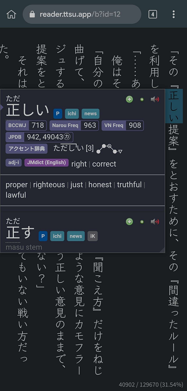
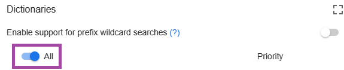

# セットアップ：Androidでライトノベル

- `Android` を使って、`Firefox` または `Edge Canary` で `Yomitan` を利用しながら単語を調べ、`Light Novel` を読むことができます。

---

## ダウンロードとインストール

- [Ankiconnect Android](https://github.com/KamWithK/AnkiconnectAndroid/releases/latest) の `.apk` ファイルをダウンロード・インストール
    - `Google Play プロテクト` をオフにする必要があるかもしれません。

- [Ankidroid](https://play.google.com/store/apps/details?id=com.ichi2.anki) をインストール

必要条件：

- [Android版 Yomitan](setupYomitanOnAndroidJP.md) の設定が完了していること

---

## セットアップ

1. `AnkiConnect Android` を開き、サービスを開始する
    - `Ankidroid` も開いて、バックグラウンドで起動したままにする

2. `Firefox` または `Edge Canary` を開く → `Yomitan Settings` → `Profile` → `Default` & `Editing` Profile → `Android (Anime, LN & Manga)` を選択
    - 自分の `Yomitan設定` を使用していない場合は、[Info 1](setupLnOnAndroidJP.md/#info-1text-replacement-pattern) を確認してください。

    {height=250 width=500}

3. 正しく動作しているか確認するため、すべてのソースが表示されていることを確認
    - 動作しない場合は、`AnkiConnect Android` の `Start Service` が起動しているか確認
    - `AnkiConnect Android` と `Ankidroid` のバッテリーセーバー・最適化が無効になっているか確認

4. これで Android 上で単語を `タップ` するだけで `マイニング` できます。

    {height=150 width=300}

これで Android のブラウザで読むことができます。

<small>問題がある場合は [FAQ](setupLnOnAndroid.md/#faqs) を確認してください。</small>

---

## 追加情報とヒント

#### Info 1：Text Replacement Pattern

??? info "Text Replacement Pattern <small>(クリック)</small>"

    自分の設定を使用しない場合、正確に文章を読み取るために以下を手動で設定する必要があります。

    1. `Yomitan settings` → 左下または下にスクロールして `Advanced` 設定を有効化

    2. `Translation` → `Configure custom text replacement patterns...`

    3. [こちら](https://pastebin.com/er57E9Hw) をコピーして貼り付け

## FAQ

#### 質問1：Androidでモノリンガル設定を使う方法

??? question "Androidでモノリンガル設定を使う方法 <small>(クリック)</small>"

    1. `Yomitan` 設定 → `Dictionary` → すべて有効化

        {height=250 width=500}