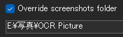
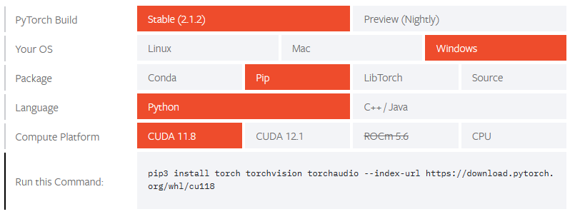
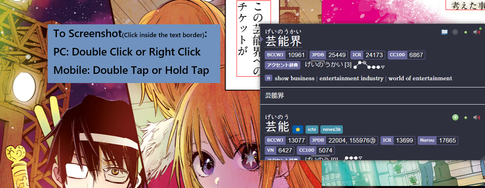

# Setup: Manga on PC

- [OCR](setupMangaOnPC.md/#setup-ocr) is a tool used to scan a `Japanese` text and return it to your clipboard which you can scan in `Yomitan`

- (Recommended) [Mokuro Manga](setupMangaOnPC.md/#setup-mokuro-manga) is a setup that first processes the `manga` to be able to hover the words and scan them using `Yomitan`

---

## OCR

Requirements

- Install [CDisplayEx](https://www.cdisplayex.com/desktop/)
    - Manga Reader for `PC`
- [Yomitan On PC](setupYomitanOnPC.md) and [ShareX](setupShareX.md) already set-up

---

## Setup: OCR

1. Download [python](https://www.python.org/downloads/release/python-3139/) (`Tested on 3.13.9 ONLY`)
    - (Scroll down) Then choose windows/mac `INSTALLER (64-bit)` and install
    - Check `Add Python to PATH`

    {height=300 width=600}

2. Open `command prompt` by winkey/search > `cmd`

3. Type `pip install owocr[mangaocr,lens]`
    - Then just let it download/install for a few mins until it's done and you can type again
    - If `pip3 is not recognized...` then:
        - Uninstall `Python`(step 1) > Restart the PC > reinstall `Python` (repeat if it didn't work; I know its dumb)

4. `Hotkey Settings`([ShareX](setupShareX.md)) > `OCR` > Click the `COG` icon > `override screenshot folder` > change the `path` to a specified `OCR` folder of your choice

    {height=150 width=300}

5. In `command prompt` type:
    - `owocr -e glens -w clipboard -j -d -r "\path\to\screenshot\folder"`
        - Copy the `path` that YOU specified in `step 4` to start the program, then just minimize the window
    - Typing `owocr` by itself without a path also works; it will `OCR`(scan) from everywhere
    - If you want a `shortcut` program see: [Info 1](setupMangaOnPC.md/#info-1-ocr-shortcut-program)

6. Capture anything using `Shift + Alt + Q` or whatever you set in `OCR` hotkey in ([ShareX](setupShareX.md))
    - Make sure [Yomitan Search Page](setupMangaOnPC.md/#__tabbed_1_1) is opened
    - If you want to `scan using mouse button`, see [Info 2](setupMangaOnPC.md/#info-2-scan-using-mouse-button)

7. You can now start reading using `OCR`
    - Default is `(l) Google Lens`, you can switch engine by tapping `(m) or (n) MangaOCR` or `(b) Bing` inside the `command prompt`

    ??? info "Video How-to <small>(click here)</small>"
        <iframe width="560" height="315" src="https://user-images.githubusercontent.com/22717958/150238361-052b95d1-0152-485f-a441-48a957536239.mp4" title="OCR How-to" frameborder="0" allow="accelerometer; autoplay; clipboard-write; encrypted-media; gyroscope; picture-in-picture; web-share" allowfullscreen></iframe>

    === "Yomitan Search Page"
        {height=300 width=600}
    === "CDisplayEx Manga"
        {height=300 width=600}

You might also want to check [Mokuro Manga](setupMangaOnPC.md/#setup-mokuro-manga)

---

## Setup: Mokuro Manga

Choose between 2 options:

- [Online Processing Method](setupMangaOnPC.md/#online-processing-method): ~processes 200 manga pages in ~15mins; straightforward guide

- [Local Processing Method](setupMangaOnPC.md/#local-processing-method): If you have a `strong PC` this is better; you are also `a know-how`

!!! note "Android Mining"

    To be able to mine in `Android` check: [Setup: Manga On Android](setupMangaOnAndroid.md)

---

### Online Processing Method

1. Follow this [Setup Guide](https://colab.research.google.com/drive/1k-M1zr4hBnZTxlRODtNFn9r08XS5bKYB?usp=sharing)

2. Download the processed `Manga` folder and see [Reading Processed Manga](setupMangaOnPC.md/#reading-processed-manga)


---

### Local Processing Method

1. Download [python](https://www.python.org/downloads/release/python-3139/) (`Tested on 3.13.9 ONLY`)
    - (Scroll down) Then choose windows/mac `INSTALLER (64-bit)` and install
    - Check `Add Python to PATH`

    {height=300 width=600}

2. Download and Install [Git](https://git-scm.com/downloads) > 64-bit setup

3. Open `command prompt` by winkey/search > `cmd`

4. Type `pip3 install mokuro`
    - Then just let it download/install for a few mins until it's done and you can type again
    - If `pip3 is not recognized...` then:
        - Uninstall `Python`(step 1) > Restart the PC > reinstall `Python` (repeat if it didn't work; I know its dumb)

5. (Optional) Use `GPU CUDA`
    - Check if your GPU is [CUDA compatible](https://developer.nvidia.com/cuda-gpus)
    - Download [CUDA Toolkit](https://developer.nvidia.com/cuda-toolkit-archive) for your operating system and version
    - Type `pip3 install torch torchvision --index-url https://download.pytorch.org/whl/cu126` in `cmd` (or find the latest from [here](https://pytorch.org/get-started/locally/#PC-verification))

    {height=300 width=600}

    - To check if it's existing, type `python` > `import torch` > `torch.cuda.is_available()`

        {height=150 width=300}

    - If it redirects you to Microsoft Store: 
        - Open `PC Powershell` > paste `input Remove-Item $env:USERPROFILE\AppData\Local\Microsoft\PCApps\python*.exe` > then `enter`
    - If problem occurs reinstall pytorch by `pip uninstall torch` in `cmd` then redo the step above, if it still failed, go check [here](https://pytorch.org/get-started/locally/#PC-verification) for other ways to verify

6. Two options to process, go to `cmd` then:
    - All Manga volumes:
        - Paste: `mokuro --parent_dir F:\Manga\Saenai`
            - Replace full directory, Saenai with your manga name(no white-spaces)
            - Your vol1, 2, 3, etc. should be inside `Saenai folder` in ascending uniform named order
    - Specific Manga volume:
        - Paste: `mokuro F:\Manga\Saenai\Vol3`
            - Replace full directory, Saenai with your manga name(no white-spaces) and volume #

    ??? examplecode "Folder Structure <small>(click here)</small>"
        
        ```
        ├── Manga Folder
        │   ├── _ocr folder
        │   ├── .html
        │   ├── .mokuro
        │   └── .zip
        │    │    └── manga img file (.jpg/.png)
        ```

7. See [Reading Processed Manga](setupMangaOnPC.md/#reading-processed-manga)

---

### Reading Processed Manga

- Skip `Step 1` if you're using my [setup](setupAnki.md)

1. In your Anki, `Ctrl + Shift + A` or `Tools` > `Add-ons`
    - Select [AnkiConnect](https://ankiweb.net/shared/info/2055492159) > `Config`
    - Under `webCorsOriginList` paste `https://reader.mokuro.app` or copy config below:

    ??? examplecode "AnkiConnect Config <small>(click here)</small>"

        ```
        {
            "apiKey": null,
            "apiLogPath": null,
            "ignoreOriginList": [],
            "webBindAddress": "127.0.0.1",
            "webBindPort": 8765,
            "webCorsOriginList": [
                "http://localhost",
                "https://reader.mokuro.app"
                ]
        }
        ```

    {height=150 width=300}

2. Go to [Mokuro Reader](https://reader.mokuro.app/) > `Upload` Icon (top right) > `choose directory`
    - Select the `Manga` folder that contains the manga, mokuro'd files and .mokuro
    - Click `Upload`

    {height=300 width=600}

3. In the top right, go to `settings` > `Profile` > `Select a File` > [Mokuro Profile](https://drive.google.com/drive/folders/17EzQL9ONQ3MVsCJwC7ejmL0317EwdR--?usp=sharing) > `Import Profiles` > Select `PC Profle`
    - Alternatively you can make your own profile just make sure to set-up everything on `Anki Connect` portion

    {height=50 width=100}

4. To be able to mine, simply add the word using `Yomitan`
    - To screenshot, make sure to double click/tap inside the `text border` (its invisible by default)

    {height=400 width=800}

5. You should now be able to mine and screenshot in your Manga with ease

!!! note "_ocr folder"

    ocr files is optional but recommended to keep

You can now mine Manga on PC, see how it's done in Android!

[Proceed to Manga on Android Setup](setupMangaOnAndroid.md){ .md-button .md-button }

<small>If you have any problems check [FAQs](setupMangaOnPC.md/#faqs)</small>

## Extra Info and Tips

#### Info 1: OCR Shortcut Program

??? info "OCR Shortcut Program <small>(click here)</small>"
    1. `Right click` in an empty space in your `Desktop` > `New` > `Shortcut`

        {height=300 width=600}

    2. Type the location of the item as:
        - Default: `C:\Windows\System32\cmd.exe /k owocr`
        - OCR only from specific folder: `C:\PC\System32\cmd.exe /k owocr -e glens -j -d -w clipboard -r "\path\to\screenshot\folder"`
            - For example: `C:\Windows\System32\cmd.exe /k owocr -e glens -j -d -w clipboard -r "E:\写真\OCR Picture"`
            - `Next` then `choose your name` and done

#### Info 2: Scan using Mouse Button

??? info "Scan using Mouse Button <small>(click here)</small>"
    1. Download and install [AutoHotkey](https://www.autohotkey.com/)

    2. Download my [Hotkey](https://drive.google.com/drive/folders/1U94qH4k6L00Wd_96tJBmI2fsOA-HS1uK?usp=sharing) then run it

    3. Use `Forward Button` to use it
        - This is assuming the `OCR` hotkey in `ShareX` is unchanged from `Shift + Alt + Q`
        - You can edit the hotkey by editing the script if you like

## FAQs