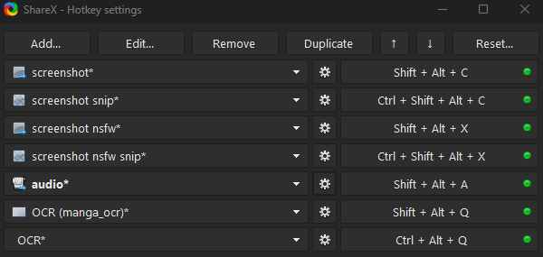
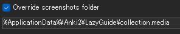

# セットアップ: ShareX

- ShareXは、`スクリーンショット`、`音声録音`、`OCR`を自動化し、Ankiカードへ簡単に追加できるツールです。
- 普段使用するコンテンツをマイニングする際に使用します。

---

## ダウンロードとインストール

- [ShareX](https://getsharex.com/) をインストールします。
- [lazyGuide-ShareX-settings-17.0.0](https://drive.google.com/drive/folders/1vxkbfe7tr27NxWP5baFaLLmqnExt-3Ba?usp=sharing) をダウンロードします。
    - 新しいバージョンのShareXでも使用できます。

---

## セットアップ

1. ShareXを開き、`アプリ設定` → `設定` → `インポート` から `lazyGuide-ShareX-settings` をインポートします。
    - ランダムな名前のファイルは空の残留ファイルなので、無視して構いません。

2. `ホットキー設定` を開き、必要に応じてホットキーや名前を変更してください。

    {height=300 width=600}

3. `ホットキー設定` で以下の項目を探します。

    - `screenshot`
    - `screenshot snip`
    - `screenshot nsfw`
    - `screenshot nsfw snip`
    - `audio`

    それぞれについて、

    - 歯車アイコンをクリック
    - `Override screenshot folder` を有効にする
    - 保存先を以下に変更してください。

      `%ApplicationData%\Anki2\**LazyGuide**\collection.media`

    - `LazyGuide` の部分は、自分のAnkiプロファイル名に変更してください。
    - プロファイル名はAnki左上、または `ファイル` → `プロファイルを切り替え` から確認できます。

    {height=150 width=300}

4. `audio` の設定を行います。

    `Hotkey Settings` → `audio` → `Screen recorder` → `Screen recorder options`

    - `Recorder Devices` をインストールします。
    - `Video source`：`None`
    - `Audio source`：`virtual-audio-capturer`

5. ShareXでスクリーンショットや音声録音を行う前に、Yomitanで単語をAnkiへ追加してください。

    - `追加 (+)` ボタンを表示するため、Ankiを起動した状態にしてください。
    - 詳しくは **Mining Demo** をご覧ください。

---

ShareXのセットアップは完了です。

<small>問題が発生した場合は、下記のFAQをご確認ください。</small>

---

## 補足情報・ヒント

#### 情報1: Mining Demo

??? info "Mining Demo <small>(クリックして開く)</small>"

    Mining Demoもぜひご覧ください。

    <iframe width="560" height="315" src="https://www.youtube.com/embed/tUiXU2gn75g" title="Mining Demo" frameborder="0" allow="accelerometer; autoplay; clipboard-write; encrypted-media; gyroscope; picture-in-picture; web-share" allowfullscreen></iframe>

#### 情報2: ホットキーの機能

??? info "ホットキーの機能 <small>(クリックして開く)</small>"

    - `screenshot` と `screenshot nsfw`
        - メインモニター全体をキャプチャします。
        - モニターを変更する場合は、
          `Hotkey Settings` → `screenshot` → `Capture` → `Select region...`

    - `screenshot snip` と `screenshot nsfw snip`
        - 指定した範囲のみをキャプチャします。

    - `OCR (manga_ocr)` は Manga OCR 用です。
      通常の `OCR` はShareX標準のOCRを使用します。

#### ヒント1: 音声録音を省略する

??? tip "音声録音を省略する <small>(クリックして開く)</small>"

    - マイニング時の音声録音は時間がかかるため、省略しても問題ありません。

    - Ankiカードを5秒以内で作成できるようになれば、録音した音声を聞く機会もほとんどありません。

---

## マウスだけでマイニングする

??? info "マウスだけでマイニングする <small>(クリックして開く)</small>"

    [AutoHotkey](https://www.autohotkey.com/) をインストールしてください。

    ホットキーは以下からダウンロードできます。

    #### パターン1：Alt + Screenshot

    - マウス進むボタン：ALT（英英辞書ポップアップ）
    - マウス戻るボタン：スクリーンショット

    #### パターン2：Audio + Screenshot

    - マウス進むボタン：音声録音
    - マウス戻るボタン：スクリーンショット

    #### パターン3：Screenshot (NSFW) + Screenshot

    - マウス進むボタン：Screenshot (NSFW)
    - マウス戻るボタン：Screenshot

---

## FAQ