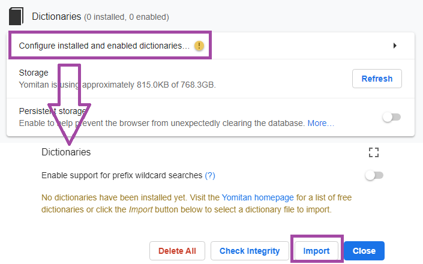
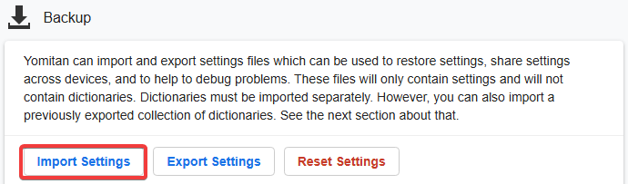
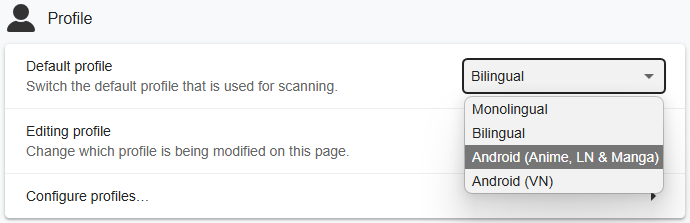
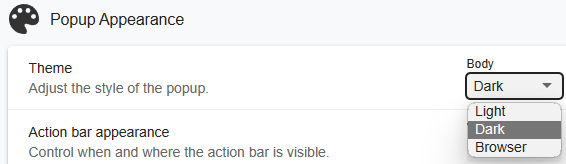

# セットアップ: Yomitan (Android)

- Yomitanは、英単語にカーソルを合わせるだけで意味を表示できるポップアップ辞書です。
- Yomitanで調べた単語をAnkiに追加するために使用します。
- Yomitan [ライトモード](../img/yomitan-light.png) | [ダークモード](../img/yomitan-dark.png) （[CSS](https://pastebin.com/T9EkQQwm)）

---

## ダウンロードとインストール

- [Firefox](https://play.google.com/store/apps/details?id=org.mozilla.firefox&pcampaignid=web_share) または [Edge Canary](https://play.google.com/store/apps/details?id=com.microsoft.emmx.canary) をインストールします。

- 以下を [ダウンロード](https://drive.google.com/drive/folders/1J86OCxN4FsNa2e0BnF-q0dh0brtqjFWQ?usp=sharing) してください。
    - `Yomitanの辞書`
    - お使いのブラウザに応じて、`yomitanの設定 (chrome/edge)` または `yomitanの設定 (firefox)` を選択してください。

- ダウンロード後
    - `Yomitanの辞書.7z`（パスワード：`lazyguide`）を展開します。
    - `Yomitanの辞書.7z` は一度だけ展開してください。辞書ファイル自体は再度展開しないでください。

---

## セットアップ

=== "Firefox"

    1. `設定` → `拡張機能` → `Yomitan Popup Dictionary` → `設定（歯車アイコン）` を開きます。

    2. `Welcome Page` で `Enable optional permissions` を有効にします。

        {height=200 width=400}

    3. `Settings Page` を開きます。
       （`設定` → `拡張機能` → `Yomitan Popup Dictionary` → `設定（歯車アイコン）`）

    4. `Dictionary` → `Configure installed and enabled dictionaries...` → `Import` を開きます。

        - `Yomitanの辞書` フォルダー内の辞書をすべてインポートしてください。（まとめて選択して一括インポートできます。）

        {height=250 width=500}

    5. 下へスクロールし、`Backup` → `Import Settings` から `Yomitanの設定` をインポートします。

        - `Yomitanの設定 (Firefox)` を選択してください。

        {height=300 width=600}

    6. `Active Profile` を `Android (Anime, LN & Manga)` に設定します。

        {height=300 width=600}

=== "Edge Canary"

    1. `メニュー` → `設定` → `Microsoft Edge について` → `プライバシーと利用規約` を開き、`Edge Canary build number` を7回タップします。

        - `Developer Options` が有効になります。

        {height=200 width=400}

    2. `設定` → `Developer Options` → `Extension install by id` を開き、以下を貼り付けます。

        ```
        idelnfbbmikgfiejhgmddlbkfgiifnnn
        ```

    3. `追加` をタップしてYomitanをインストールします。

        - ダウンロード完了後、`Welcome Page` が自動で開きます。
        - 開かない場合は、`設定` → `拡張機能` → `Yomitan Popup Dictionary` → `設定（歯車アイコン）` を開いてください。

    4. `Welcome Page` で `Enable optional permissions` を有効にします。

        {height=200 width=400}

    5. `Settings Page` を開きます。

    6. `Dictionary` → `Configure installed and enabled dictionaries...` → `Import` を開きます。

        - `Yomitanの辞書` フォルダー内の辞書をすべてインポートしてください。（まとめて選択して一括インポートできます。）

        {height=250 width=500}

    7. 下へスクロールし、`Backup` → `Import Settings` から `Yomitanの設定` をインポートします。

        - `Yomitanの設定 (Chrome)` を選択してください。

        {height=300 width=600}

    8. `Active Profile` を `Android (Anime, LN & Manga)` に設定します。

        {height=300 width=600}

---

Android版Yomitanのセットアップは完了です。

次は、より快適にマイニングを行うためにShareXをセットアップしましょう。

[Androidのブラウザのセットアップへ](setupLnOnAndroidJP.md){ .md-button .md-button }

<small>問題が発生した場合は、下記のFAQをご確認ください。</small>

---

## 補足情報・ヒント

#### 情報1: Yomitanのライトモード・ダークモード

??? info "Yomitanのライトモード・ダークモード <small>(クリックして開く)</small>"

    テーマを変更するには、

    `Yomitan Settings` → `Appearance` → `Theme`

    を開いてください。

    {height=300 width=600}

---

## FAQ

#### 質問1: 好きな辞書を追加・削除・変更できますか？

??? question "好きな辞書を追加・削除・変更できますか？ <small>(クリックして開く)</small>"

    - はい。ほとんどの辞書はこのAnkiテンプレートと互換性があります。

#### 質問2: 辞書はいつ更新されますか？自分で更新した方がいいですか？

??? question "辞書はいつ更新されますか？自分で更新した方がいいですか？ <small>(クリックして開く)</small>"

    - 辞書の更新はあまり行いません。
    - 辞書の内容は頻繁に変わるものではないため、最新版にこだわる必要はありません。

        - 長期間安定して使えることを重視しています。
        - 最新版を使いたい場合は、ご自身で更新していただいて構いません。

#### 質問3: 文例カードを使うには？

??? question "文例カードを使うには？ <small>(クリックして開く)</small>"

    `Yomitan Settings` → `Anki` → `Configure Anki flashcards...` を開きます。

    {height=300 width=600}

    `Terms` を下へスクロールし、`IsSentenceCard` を `1` に設定して閉じます。

    {height=300 width=600}

    その後、`Editing Profile` にあるすべてのプロファイルへ適用してください。

    - `Monolingual`
    - `Bilingual`
    - `Android (Anime, LN & Manga)`
    - `Android (VN)`

    {height=300 width=600}