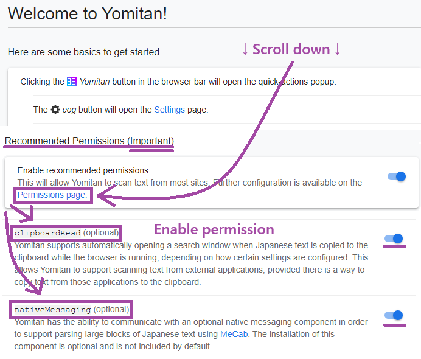
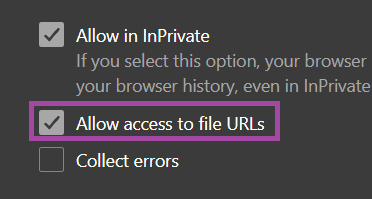
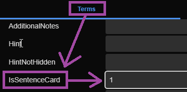

# Setup Yomitan PC

- Yomitan is a mouse hover dictionary for Japanese
- Used for `mining` to `Anki`
- Yomitan [Light](../img/yomitan-light.png) | [Dark](../img/yomitan-dark.png) Mode ([CSS](https://pastebin.com/T9EkQQwm))

---

## Download and Install

- Install [Yomitan Chrome/Edge](https://chrome.google.com/webstore/detail/yomitan/likgccmbimhjbgkjambclfkhldnlhbnn) or [Yomitan Firefox](https://addons.mozilla.org/en-US/firefox/addon/yomitan/)

- Download from [here](https://drive.google.com/drive/folders/1DHJ18Lk2_tVYWJ1Adhe8XByuyFBGuTr_?usp=sharing):
    - `Font`
    - `yomitan dictionary`
    - `lazyGuide-yomitan-settings`(download both)
        - Firefox/Brave: `yomitan settings` [here](https://drive.google.com/drive/folders/1D_O7HgX4xMBOQcl2tLoeAQ7KUtPqyUnU?usp=sharing)

- After Downloading:
    - Extract([?](https://www.webhostinghub.com/help/learn/website/managing-files/extract-file)) `Font.7z` and `yomitan dictionary.7z` (Pass: `lazyguide`)
    - `yomitan dictionary.7z` should only be extracted once, `don't extract the dictionary` itself

---

## Setting Up

1. On `Yomitan`'s welcome page, scroll down > `Permissions page` > enable `clipboardRead` and `nativeMessaging`

    {height=250 width=500}

2. Go to `chrome://extensions` or `edge://extensions` or `about:addons`(firefox) and go to `Yomitan` extension settings

3. Make sure for:
    - Chrome/Edge: `Allow access to file URLs` is enabled
    - Firefox: `Access your data for all websites` is enabled

    === "Chrome/Edge"
        {height=150 width=300}
    === "Firefox"
        {height=300 width=600}

4. Install the `Fonts` by opening them from the `Font` folder

    {height=150 width=300}

5. Go to `Yomitan`’s settings page (Click on the extension’s icon then click on the cog icon from the popup)

    {height=50 width=100}

6. Go to `Dictionary` > `Configure installed and enabled dictionaries...` > `Import`
    - Import all the dictionaries from `yomitan dictionary` folder (You can select them all and import all at once)
    - After importing; turn ON `Jitendex` and put it as priority #1 (very top)

    {height=250 width=500}

7. Then Scroll down, in `Backup` > `Import Settings` > `lazyGuide-yomitan-settings` (the file from [here](setupYomitanOnPC.md/#download-and-install))
    - Pick either:
        - `lazyGuide-local-audio-yomitan-settings` (Install: [Yomitan Local Audio](setupYomitanOnPC.md/#info-1-yomitan-local-audio))
        - `lazyGuide-non-local-audio-yomitan-settings`

        {align=left height=300 width=600}

8. Pick a `Active profile`, usually between `Monolingual` and `Bilingual` (other profiles will be discussed in other sections)
    - `Bilingual` is default, you can hold `alt` while hovering over a word to use the `Monolingual` profile

        {align=left height=300 width=600}

9. You should now be able to hover over words!
    - To change hotkey, `Yomitan` settings > `Scanning` > `Scan modifier key`
    
        {align=left height=300 width=600}
    

Yomitan on PC setup is done, why not check out how to use Yomitan on Android?

[Proceed to Yomitan on Android Setup](setupYomitanOnAndroid.md){ .md-button .md-button }

<small>If you have any problems check [FAQs](setupYomitanOnPC.md/#faqs)</small>

---

## Extra Info and Tips

#### Info 1: Yomitan Local Audio

??? info "Yomitan Local Audio <small>(click here)</small>"

    - Here's the [source](https://github.com/themoeway/local-audio-yomichan) for more info or latest updates
    - This might take an hour due to extraction; need Anki 2.1.50+
    - [Yomitan Local Audio Source for Android](https://github.com/KamWithK/AnkiconnectAndroid#additional-instructions-local-audio) is also available but this(PC) setup is required

    ---

    1. Download everything from the [recommended](https://github.com/yomidevs/local-audio-yomichan?tab=readme-ov-file#steps)

    2. Within `Anki`: either `Ctrl + Shift + A` or `Tools` > `Add-ons` > `Get Add-ons...` > `1045800357` > restart `Anki`

    3. Extract `local-yomitan-audio-collection` and paste the `user_files` folder to:
        - On `Add-ons window` > select the `Local Audio Server for Yomitan` > `View Files`
        - Or `C:\Users\YourUser\AppData\Roaming\Anki2\addons21\1045800357`

    4. My `local-audio-yomitan` settings OR if you are not using my profile:
        - Go to `Yomitan settings` > `Audio` > `Configure audio playback sources...` > `Add` > `Custom URL (JSON)`
        - Paste `http://localhost:5050/?term={term}&reading={reading}` and make sure it's on the top

    5. Check if it's working:
    
        {height=250 width=500}

        DONE!

#### Info 2: Yomitan Light and Dark Mode

??? info "Yomitan Light and Dark Mode <small>(click here)</small>"

    To change the Yomitan theme, go to `Yomitan settings` > `Appearance` > `Theme`

    {height=300 width=600}

---

## FAQs

#### Question 1: Can I add a Yomitan dictionary of my choice?

??? question "Can I add, delete or modify a Yomitan dictionary of my choice? <small>(click here)</small>"

    - Yes, most dictionaries should be compatible with the Anki format

    - You might need to edit on `Yomitan settings` > `Anki` > `Configure Anki flashcards...` > `MainDefinition` > open dropdown menu, search for the `single-glossary-YOUR-CHOICE`

    - If you changed `MainDefinition`, you need to edit every `Yomitan Profile`

#### Question 2: When will you update the dictionaries/should I do it myself?

??? question "When will you update the dictionaries/should I do it myself? <small>(click here)</small>"

    - I will seldomly update; no need to stress over the latest one; it barely changes its content as a dictionary
        - My goal is longterm stability without worrying about updates
        - You can update it youself if you want to chase the latest fad

#### Question 3: How can I use sentence card?

??? question "How can I use sentence card? <small>(click here)</small>"

    In your `Yomitan settings` > `Anki` > `Configure Anki flashcards...`

    {height=300 width=600}
    
    In `Terms` scroll down and find `IsSentenceCard` and put `1` then close the window

    {height=300 width=600}

    Now apply it on every profile under `Editing Profile` and make sure `Monolingual`, `Bilingual`, `Android (Anime, LN & Manga)` and `Android (VN)` got their config changed

    {align=left height=300 width=600}
