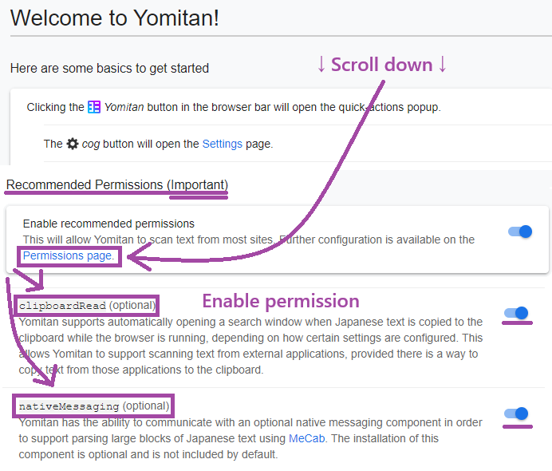
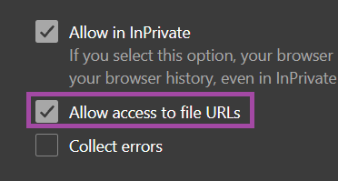
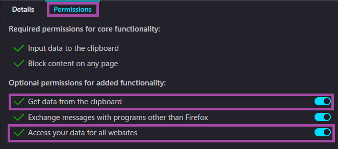
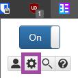
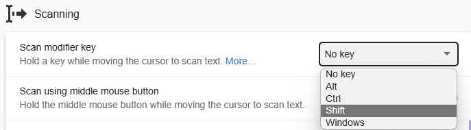

# セットアップ: Yomitan (PC)

- Yomitanは、英単語にカーソルを合わせるだけで意味を表示できるポップアップ辞書です。
- Yomitanで調べた単語をAnkiに追加するために使用します。
- Yomitan [ライトモード](../img/yomitan-light.png) | [ダークモード](../img/yomitan-dark.png) （[CSS](https://pastebin.com/T9EkQQwm)）

---

## ダウンロードとインストール

- [Yomitan Chrome/Edge版](https://chrome.google.com/webstore/detail/yomitan/likgccmbimhjbgkjambclfkhldnlhbnn) または [Yomitan Firefox版](https://addons.mozilla.org/en-US/firefox/addon/yomitan/) をインストールします。

- 以下を [ダウンロード](https://drive.google.com/drive/folders/1J86OCxN4FsNa2e0BnF-q0dh0brtqjFWQ?usp=sharing) してください。
    - `Yomitanの辞書`
    - お使いのブラウザに応じて、`yomitanの設定 (chrome/edge)` または `yomitanの設定 (firefox)` を選択してください。

- ダウンロード後
    - `yomitanの辞書.7z`（パスワード：`lazyguide`）を展開します。
    - `yomitanの辞書.7z` は一度だけ展開してください。辞書ファイル自体は再度展開しないでください。

---

## セットアップ

1. Yomitanのウェルカムページを開き、一番下の **Permissions** ページまでスクロールして、`clipboardRead` と `nativeMessaging` を有効にします。

    {height=250 width=500}

2. `chrome://extensions`、`edge://extensions`、または `about:addons`（Firefox）を開き、Yomitanの拡張機能設定を開きます。

3. 以下の設定が有効になっていることを確認してください。

    - Chrome / Edge：`ファイルのURLへのアクセスを許可`
    - Firefox：`すべてのウェブサイトに対するデータへのアクセス`

    === "Chrome/Edge"
        {height=150 width=300}
    === "Firefox"
        {height=300 width=600}

4. Yomitanの設定画面を開きます。（拡張機能アイコンをクリックし、ポップアップ右上の歯車アイコンをクリック）

    {height=50 width=100}

5. `Dictionary` → `Configure installed and enabled dictionaries...` → `Import` を開きます。

    - `yomitanの辞書` フォルダー内の辞書をすべてインポートしてください。（まとめて選択して一括インポートできます。）

    {height=250 width=500}

6. 下へスクロールし、`Backup` → `Import Settings` から `yomitanの設定`（「ダウンロードとインストール」で取得したファイル）をインポートします。

    - お使いのブラウザに応じて、`yomitanの設定 (chrome/edge)` または `yomitanの設定 (firefox)` を選択してください。

    {height=300 width=600}

7. これで単語にカーソルを合わせると辞書が表示されるようになります。

    - ホットキーを変更する場合は、`Yomitan Settings` → `Scanning` → `Scan modifier key` を変更してください。

    {height=300 width=600}

---

PC版Yomitanのセットアップは完了です。

続いてAndroid版Yomitanのセットアップを行いましょう。

[Android版Yomitanのセットアップへ](setupYomitanOnAndroidJP.md){ .md-button .md-button }

<small>問題が発生した場合は、下記のFAQをご確認ください。</small>

---

## 補足情報・ヒント

#### 情報1: Yomitanのライトモード・ダークモード

??? info "Yomitanのライトモード・ダークモード <small>(クリックして開く)</small>"

    テーマを変更するには、

    `Yomitan Settings` → `Appearance` → `Theme`

    を開いてください。

    {height=300 width=600}

---

## FAQ

#### 質問1: 好きな辞書を追加・削除・変更できますか？

??? question "好きな辞書を追加・削除・変更できますか？ <small>(クリックして開く)</small>"

    - はい。ほとんどの辞書はこのAnkiテンプレートと互換性があります。

    - 必要に応じて、

      `Yomitan Settings` → `Anki` → `Configure Anki flashcards...` → `MainDefinition`

      を開き、プルダウンから `single-glossary-お好みの辞書名` を選択してください。

    - `MainDefinition` を変更した場合は、すべての `Yomitan Profile` に同じ設定を適用してください。

#### 質問2: 辞書はいつ更新されますか？自分で更新した方がいいですか？

??? question "辞書はいつ更新されますか？自分で更新した方がいいですか？ <small>(クリックして開く)</small>"

    - 辞書の更新はあまり行いません。
    - 辞書の内容は頻繁に変わるものではないため、最新版にこだわる必要はありません。

        - 長期間安定して使えることを重視しています。
        - 最新版を使いたい場合は、ご自身で更新していただいて構いません。

#### 質問3: 文例カードを使うには？

??? question "文例カードを使うには？ <small>(クリックして開く)</small>"

    `Yomitan Settings` → `Anki` → `Configure Anki flashcards...` を開きます。

    {height=300 width=600}

    `Terms` を下へスクロールし、`IsSentenceCard` を `1` に設定して閉じます。

    {height=300 width=600}

    その後、`Editing Profile` にあるすべてのプロファイルへ適用してください。

    - `Monolingual`
    - `Bilingual`
    - `Android (Anime, LN & Manga)`
    - `Android (VN)`

    {height=300 width=600}